# AI_PM_Skills

> AI 에이전트를 '제품'으로 만드는 PM을 위한 36개 스킬 — AI를 '도구'로 쓰는 것과는 다릅니다

[](LICENSE)
[]()
[]()
[](CONTRIBUTING.md)
[](README.md)

> ⭐ **AI 에이전트를 만드는 PM이라면, 이 레포에 Star를 눌러주세요** — 에이전트 제품의 전체 라이프사이클을 다루는 유일한 스킬셋입니다.

<p align="center">
  
</p>

---

## 왜 이 프로젝트를 만들었나

2026년, PM들에게 "에이전트를 만들라"는 요구가 쏟아지고 있습니다.

그런데 기존 PM 스킬은 이 상황에 맞지 않습니다. 시중의 PM 스킬들은 **AI를 도구로 쓰는 법** — PRD를 빨리 쓰고, OKR을 자동 생성하고, 경쟁사를 분석하는 데 초점을 맞추고 있죠. 하지만 **에이전트를 제품으로 만드는 순간**, 부딪히는 질문은 완전히 달라집니다:

- "이 에이전트를 하루 1,000명이 쓰면 비용이 얼마나 나올까?"
- "에이전트가 환각(hallucination)을 일으키면 어떻게 복구시키지?"
- "에이전트 여러 개를 어떻게 조합하고 오케스트레이션하지?"
- "3개월 동안 쌓은 운영 노하우를 에이전트 인스트럭션에 어떻게 녹이지?"

저도 같은 질문을 했습니다. AI Dubbing, AI Avatar 서비스를 성장시키면서, 그리고 지금 Agentic AI 제품을 만들면서 마주친 문제들이었습니다. 그 경험을 체계화해서, 에이전트 라이프사이클 전체를 커버하는 **36개 프로덕션급 스킬**로 정리한 것이 이 프로젝트입니다.

---

## 빠른 시작 (30초)

```bash
# 1. 플러그인 설치
/plugin marketplace add kimsanguine/AI_PM_Skills
/plugin install oracle@kimsanguine-AI_PM_Skills

# 2. 자연어로 작업을 설명하면 — 적합한 스킬이 자동으로 로드됩니다
"우리 CS팀이 하루 500건의 티켓을 처리하는데, 어떤 부분을 에이전트가 맡아야 할까?"
# → opp-tree 스킬 자동 로드 → 기회 매핑 시작
```

스킬 이름을 외울 필요가 없습니다. 평소처럼 자연어로 질문하면, Claude가 36개 스킬 중 가장 적합한 것을 자동으로 찾아서 로드합니다. 96개 테스트 쿼리 기준 **97.9% 정확도**로 올바른 스킬이 발동됩니다.

---

## 에이전트 PM 여정 — 5단계

이 프로젝트의 36개 스킬은 무작위 모음이 아닙니다. 에이전트 제품을 만드는 PM이 반드시 거치는 **5단계 여정**에 맞춰 설계되었습니다.

```
발견(Discover) → 설계(Architect) → 실행(Ship) → 운영(Operate) → 학습(Learn)
   oracle            atlas            forge          argus          muse
  6 skills          7 skills        12 skills       8 skills       3 skills
     ↑                                                               │
     └──────────── 축적된 TK가 다음 에이전트에 피드백 ─────────────────┘
```

| 단계 | 플러그인 | 이 단계에서 부딪히는 질문 | 주요 스킬 |
|------|---------|------------------------|----------|
| **발견** | `oracle` | "어떤 에이전트를 만들어야 할까?" | opp-tree · assumptions · build-or-buy · cost-sim · hitl · agent-gtm |
| **설계** | `atlas` | "어떻게 구조를 잡을까?" | 3-tier · orchestration · router · memory-arch · moat · growth-loop · biz-model |
| **실행** | `forge` | "어떻게 스펙을 쓰고 출시할까?" | claude-md · prd · instruction · prompt · ctx-budget · okr · stakeholder-map · agent-plan-review + 커뮤니케이션 4종 |
| **운영** | `argus` | "어떻게 측정하고 개선할까?" | kpi · reliability · premortem · burn-rate · north-star · agent-ab-test · cohort · incident |
| **학습** | `muse` ⭐ | "에이전트가 시간이 갈수록 똑똑해지려면?" | pm-framework · pm-decision · pm-engine |

특히 중요한 건 **마지막 단계인 muse → 첫 단계인 oracle로 이어지는 순환 구조**입니다. muse에서 축적한 PM 운영 노하우(TK)가 다음 에이전트를 만들 때 자동으로 반영되기 때문에, 에이전트를 만들수록 다음 에이전트의 품질이 올라갑니다.

스킬 간에는 **자동 라우팅**도 작동합니다. 예를 들어 burn-rate(argus)로 토큰 비용을 분석하다 급증이 감지되면, router(atlas)에게 모델 변경을 제안하고, 다시 cost-sim(oracle)에서 비용 재시뮬레이션까지 연결됩니다. PM이 직접 "다음 스킬을 불러줘"라고 말할 필요가 없습니다.

---

## 이 프로젝트가 다른 이유 — 다른 스킬셋이 못하는 6가지

### ① 완전한 에이전트 라이프사이클 — 단편적 도구 모음이 아닙니다

시중의 PM 스킬셋은 대부분 "AI로 뭔가를 빠르게 하는 도구"입니다. PRD 자동생성, OKR 작성기, 경쟁사 분석기 같은 것들이죠. 하지만 에이전트를 제품으로 만들 때는 "어떤 에이전트를 만들지 → 어떻게 설계할지 → 어떻게 스펙을 쓸지 → 어떻게 운영할지 → 어떻게 학습시킬지"라는 **연속된 흐름**이 필요합니다.

AI_PM_Skills의 36개 스킬은 이 5단계에 정확히 매핑됩니다. 발견부터 자기개선 에이전트까지, **에이전트를 제품으로 만드는 구조화된 방법론**입니다.

### ② 2레이어 아키텍처 — Platform과 Content의 분리

스킬이 많아지면 반드시 생기는 문제가 있습니다: **"엉뚱한 스킬이 발동된다."** 36개 스킬이 서로 비슷한 키워드에 반응하면, Claude가 혼동을 일으키거든요.

이 문제를 해결하기 위해 **두 층을 분리**했습니다. Claude가 스킬을 찾는 메커니즘(Platform Layer — Skills 2.0 스펙의 frontmatter, auto-invocation 등)과, 각 스킬 안에서 "언제 나를 부르고, 언제 부르지 말아야 하는지"를 정의하는 내용(Content Layer — Trigger Gate 패턴)을 분리한 것입니다.

```
┌─ Platform Layer ──── Skills 2.0 Spec ──────────────────────┐
│  frontmatter · auto-invocation · subagent · hooks · evals   │
├─ Content Layer ──── AI_PM_Skills 독자 패턴 ────────────────┤
│  Core Goal → Trigger Gate(Use/Route/Boundary)               │
│  → Failure Handling → Quality Gate → Examples               │
│  → context/domain.md (도메인 전문지식)                       │
└─────────────────────────────────────────────────────────────┘
```

Trigger Gate의 핵심은 세 가지입니다:
- **Use**: "이런 상황에서 나를 불러라" (정확한 발동 조건)
- **Route**: "이런 상황이면 다른 스킬에게 넘겨라" (플러그인 간 라우팅)
- **Boundary**: "이런 상황에서는 절대 나를 부르지 마라" (오발동 방지)

이 패턴 덕분에 96개 테스트 쿼리에서 **97.9% 트리거 정확도**를 달성했습니다. 36개 스킬이 서로 충돌하지 않고 정확하게 발동됩니다.

### ③ 데이터 플라이휠 — 쓸수록 쌓이는 PM 암묵지

이 프로젝트의 진짜 해자(moat)는 muse 플러그인입니다.

PM이 수년간 쌓은 운영 판단력 — "이런 상황에서는 이렇게 해야 해", "이 지표가 떨어지면 이게 원인일 확률이 높아" — 이런 암묵지는 보통 PM의 머릿속에만 있습니다. muse는 이것을 **TK(Tacit Knowledge) 단위**로 구조화합니다.

```
PM의 판단/경험 기록 → /extract 명령어 → TK-NNN으로 구조화
  → PM-ENGINE-MEMORY.md에 축적 → /tk-to-instruction으로
  → 에이전트 시스템 프롬프트에 자동 반영 → 쓸수록 반복·축적
```

**왜 이게 중요하냐면**, 이렇게 축적된 TK는 경쟁자가 복사할 수 없기 때문입니다. 프레임워크 자체는 오픈소스이지만, PM-ENGINE-MEMORY.md에 쌓인 당신만의 판단 기록은 당신의 자산입니다. 에이전트를 오래 운영할수록 이 데이터가 쌓이고, 그게 다음 에이전트의 품질을 올리는 **전환비용(switching cost)**이 됩니다.

### ④ Eval 기반 ROI — "좋아졌다"는 느낌이 아닌, 숫자로 증명

"스킬을 설치하면 뭐가 좋아지는데?"라는 질문에 "느낌적으로 좋아집니다"라고 답하지 않습니다.

모든 스킬은 **54개 어설션을 포함한 10개 품질 테스트**로 측정됩니다. 같은 질문을 스킬 있이/없이 Claude에게 던져서, 출력 품질 차이를 정량화합니다.

| | 스킬 적용 | 스킬 미적용 | 차이 |
|---|-----------|-----------|------|
| **테스트 통과율** | **100%** | 88% | **+12%** |

구체적으로 보면, `pm-framework` 스킬 없이 Claude에게 "운영 노하우를 구조화해줘"라고 하면 통과율이 40%까지 떨어집니다. `cost-sim` 스킬을 적용하면 비용 분석 산출량이 +46.6% 증가합니다. 이런 숫자가 있기 때문에, 어떤 스킬이 실제로 가치를 더하는지, 어떤 스킬을 개선해야 하는지를 **데이터로 판단**할 수 있습니다.

### ⑤ Good/Bad 예시 — 스킬 품질을 지속적으로 개선하는 장치

모든 스킬에는 `examples/good-01.md`(이상적인 출력)와 `examples/bad-01.md`(피해야 할 출력)가 포함됩니다. 여기에 `references/test-cases.md`의 엣지 케이스 테이블까지 있습니다.

이게 왜 중요하냐면, LLM 기반 스킬은 **"뭘 잘했는지, 뭘 못했는지"를 명확히 정의하지 않으면 개선할 수가 없습니다.** Good/Bad 예시가 있으면 Claude의 출력을 구체적인 기준으로 평가할 수 있고, 그 결과를 다시 스킬 개선에 반영할 수 있습니다. 장식이 아니라, 스킬 품질을 측정 가능하고 지속적으로 개선 가능하게 만드는 핵심 장치입니다.

### ⑥ Skills 2.0 최신 스펙 + 즉시 시작 가능한 온보딩

Claude Code의 최신 플랫폼 스펙을 모두 적용했습니다: auto-invocation(자동 호출), `context: fork`(서브에이전트 분리), `allowed-tools`(도구 접근 제한), `model` 필드(모델 지정), 동적 `!command` 주입, marketplace 배포, eval 시스템까지.

그런데 스펙만 따르면 새 사용자가 빈 파일로 시작해야 합니다. 그래서 [PM-ENGINE-MEMORY 스타터 킷](muse/skills/pm-engine/examples/PM-ENGINE-MEMORY-STARTER.md)을 함께 제공합니다. 실무에서 자주 쓰이는 5개 시드 TK(긴급 요청 우선순위, AI 네이티브 사고 필터, 에이전트 비용 10배 법칙 등)가 미리 들어 있어서, 설치 직후부터 muse의 가치를 체감할 수 있습니다. "데이터가 쌓이면 좋아질 거야"가 아니라, **설치한 순간부터 바로 쓸 수 있는** 설계입니다.

---

## 플러그인 — 전체 스킬 목록

<details>
<summary><strong>1. oracle</strong> — 어떤 에이전트를 만들까? <code>(6 skills, 2 commands)</code></summary>

에이전트를 만들기 전에 반드시 답해야 할 질문들 — "어디에 기회가 있는지", "리스크는 뭔지", "직접 만들어야 하는지 사야 하는지", "비용은 얼마인지"를 체계적으로 분석합니다.

| 스킬 | 기능 | 이런 상황에서 쓰세요 |
|------|------|-------------------|
| `opp-tree` | 반복 빈도·자동화 적합도·판단 의존도로 점수화한 기회 트리 구축 | "자동화 후보가 10개인데, 뭘 먼저 해야 할까?" |
| `assumptions` | 4축(가치·실현가능성·신뢰성·윤리) 기준 최고 위험 가정 추출 + 2일 검증 실험 설계 | "개발 시작 전에 가장 큰 리스크부터 확인하고 싶어" |
| `build-or-buy` | 6축 기준 Build vs Buy vs No-code 점수화 (차별화, 속도, 비용, 커스터마이징, 유지보수, 도메인) | "Intercom 봇을 쓸까, 우리가 직접 만들까?" |
| `hitl` | 가역성 × 오류영향 매트릭스로 자동화 레벨(1~5)과 에스컬레이션 기준 설정 | "환불 결정을 에이전트에게 맡겨도 괜찮을까?" |
| `cost-sim` | 1→10→100→1,000명 규모별 월간 운영 비용 시뮬레이션 (모델 가격 × 호출 패턴) | "Sonnet으로 하루 500콜이면 월 얼마 나올까?" |
| `agent-gtm` | 비치헤드 세그먼트 5기준 점수 + Shadow→Co-pilot→Auto→Delegation 신뢰 시퀀스 설계 | "B2B 고객에게 이 에이전트를 어떤 순서로 내보내지?" |

**명령어:** `/discover`(전체 기회 탐색) · `/validate`(가정 검증)
</details>

<details>
<summary><strong>2. atlas</strong> — 어떻게 설계할까? <code>(7 skills, 2 commands)</code></summary>

에이전트의 구조를 잡는 단계입니다. 에이전트가 하나일 때는 괜찮지만, 여러 개가 협업해야 할 때 — 누가 전략을 짜고, 누가 실행하고, 비용은 어떻게 줄이고, 해자는 어떻게 만들지를 설계합니다.

| 스킬 | 기능 | 이런 상황에서 쓰세요 |
|------|------|-------------------|
| `3-tier` | Prometheus(전략) → Atlas(조율) → Worker(실행) 역할·통신·위임 설계 | "에이전트 5개가 필요한데, 누가 누구를 통제해야 하지?" |
| `orchestration` | Sequential/Parallel/Router/Hierarchical 패턴을 레이턴시·오류율·비용으로 비교 | "문서 처리 파이프라인을 직렬로 돌릴까, 병렬로 돌릴까?" |
| `biz-model` | 건당/구독/성과 기반 과금 설계 + 변동비 분석 (70% 이상 마진 타겟) | "API 호출당 과금? 월정액? 어떤 모델이 맞을까?" |
| `router` | 복잡도별 T1~T4 모델 자동 라우팅 + 폴백 체인으로 40-80% 비용 절감 | "단순 FAQ는 Haiku, 복잡 분석은 Opus — 자동으로 나눠줘" |
| `memory-arch` | Working/Episodic/Semantic/Procedural 메모리 레이어 + 토큰 예산 인식 검색 | "오늘 세션에서 어제 대화 맥락을 어떻게 기억시키지?" |
| `moat` | 6가지 해자 진단: 데이터 플라이휠, 워크플로우 락인, 네트워크 효과, 전환비용, 전문화, 브랜드 | "경쟁사가 GPT로 비슷한 걸 만들면, 우리 방어선은?" |
| `growth-loop` | 사용→데이터→개선→재사용 루프 설계 + 콜드스타트 해법 + 역루프(anti-loop) 식별 | "추천 결과가 쓸수록 좋아지게 만들려면?" |

**명령어:** `/architecture`(아키텍처 설계) · `/strategy-review`(전략 리뷰)
</details>

<details>
<summary><strong>3. forge</strong> — 어떻게 스펙을 쓰고 출시할까? <code>(12 skills, 3 commands)</code></summary>

실제로 만들고 출시하는 단계입니다. 프로젝트 온보딩(CLAUDE.md 자동 생성)부터 에이전트 전용 PRD 작성, 시스템 프롬프트 설계, 토큰 예산 관리, 이해관계자 설득 자료 제작까지 포함합니다.

> **온보딩 (1):** claude-md
> **Core Spec (7):** instruction · prd · prompt · ctx-budget · okr · stakeholder-map · agent-plan-review
> **커뮤니케이션 (4):** gemini-image-flow · infographic-gif-creator · pptx-ai-slide · agent-demo-video

| 스킬 | 기능 | 이런 상황에서 쓰세요 |
|------|------|-------------------|
| `claude-md` ⭐ | 프로젝트 구조 스캔 → CLAUDE.md 자동 생성 → 맞춤형 AI_PM_Skills 플러그인 추천 | "새 프로젝트에 Claude Code를 세팅하고, 어떤 스킬을 쓸지 추천받고 싶어" |
| `instruction` | Role/Context/Goal/Tools/Memory/Output/Failure 정의 + 최소 권한 도구 접근 설계 | "시스템 프롬프트에 뭘 넣고 뭘 빼야 하지?" |
| `prd` | 7섹션 에이전트 스펙 (Instruction/Tools/Memory/Triggers/Output/Failure) + 기술·비즈니스 이중 서술 | "환각 복구 시나리오와 도구 권한까지 포함된 PRD가 필요해" |
| `prompt` | CRISP 프레임워크(Context/Role/Instruction/Scope/Parameters) + Why-First 원칙 + 7가지 실패 패턴 회피 | "프롬프트가 길어질수록 에이전트가 오히려 이상하게 동작해" |
| `ctx-budget` | 파일별 토큰 사용량 추정 → Essential/Conditional/Excluded 분류 → 70% 임계값 알림 | "RAG 문서 5개 + 대화 히스토리를 128K 컨텍스트에 어떻게 넣지?" |
| `okr` | 이중축 OKR: 비즈니스 임팩트 + 운영 건강도, 필수 비용 KR 포함 | "정확도 95%면 충분한가? 비용 지표도 넣어야 하는 거 아닌가?" |
| `stakeholder-map` | Power-Interest 매트릭스 + 블로커 대응 전략 + 내부 챔피언 발굴 | "법무팀이 에이전트 출시를 막고 있어, 어떻게 설득하지?" |
| `agent-plan-review` | 4축 리뷰 + 실패 모드 매트릭스(5+ 유형) + Mermaid 다이어그램 출력 | "코딩 시작 전에 이 설계의 허점을 찾아줘" |
| `gemini-image-flow` | Gemini API 엔드투엔드 이미지 파이프라인 + 모델 티어 자동 선택 | "스케치→코드 변환 파이프라인을 만들고 싶어" |
| `infographic-gif-creator` | 아키텍처/워크플로우 다이어그램 → HTML/CSS → GIF/MP4 애니메이션 | "멀티에이전트 흐름을 임원에게 시각적으로 보여줘야 해" |
| `pptx-ai-slide` | 스토리 기반 슬라이드 (피치/리뷰/투자자 변형 자동 생성) | "이사회 발표용 10장짜리 덱이 필요해" |
| `agent-demo-video` | 화면 녹화 + 애니메이션 + 나레이션 조합 (Remotion 기반) | "비기술 이해관계자에게 에이전트가 뭘 하는지 보여줘야 해" |

**명령어:** `/write-prd`(PRD 작성) · `/set-okr`(OKR 설정) · `/sprint`(스프린트 계획)
</details>

<details>
<summary><strong>4. argus</strong> — 어떻게 측정하고 개선할까? <code>(8 skills, 2 commands)</code></summary>

에이전트를 출시한 다음이 진짜 시작입니다. 에이전트는 전통적인 소프트웨어와 달리 "조용히 틀리는" 경우가 많기 때문에, 운영 지표 설정·비용 추적·실패 감지·실험 설계가 모두 필요합니다.

| 스킬 | 기능 | 이런 상황에서 쓰세요 |
|------|------|-------------------|
| `kpi` | 운영 + 비즈니스 5~7개 지표 정의, 선행/후행 지표 구분 | "에이전트 대시보드에 어떤 지표를 넣어야 하지?" |
| `reliability` | P95/P99 최악 케이스 정량화 + 세이프가드 설계 + SLA 티어 설정 | "100건 중 3건이 환각인데, 이게 허용 가능한 수준인가?" |
| `premortem` | 10~15개 실패 모드를 심각도 × 가능성 × 탐지 난이도로 점수화 | "'절대 깨지면 안 되는' 항목 리스트를 뽑아줘" |
| `burn-rate` | 모델·태스크별 토큰 비용 시각화 + 급증 감지 + 예산 상한 설정 | "이번 달 토큰 비용이 40% 올랐어 — 원인이 뭐야?" |
| `north-star` | 5가지 기준으로 핵심 지표 1개 선택 + 안티메트릭 설정 | "팀원마다 다른 KPI를 보고 있어, 뭘 기준으로 맞추지?" |
| `agent-ab-test` | MDE(최소 탐지 효과) 계산 + 동시 실험 설계 + LLM 비결정성 통제 | "프롬프트 A vs B — 진짜 차이가 있는 건지, 그냥 노이즈인지?" |
| `cohort` | 배포 코호트별 성과 추적 (최소 4주, n≥100 기준) | "v2.1이 정말로 v2.0보다 나아졌는지 확인하고 싶어" |
| `incident` | 무증상 장애 감지 + 트리아지 + 영향 범위 차단 + 5 Whys 분석 | "에이전트가 30분째 응답이 없는데 알림도 안 울려" |

**명령어:** `/health-check`(전체 건강 점검) · `/cost-review`(비용 리뷰)
</details>

<details>
<summary><strong>5. muse ⭐</strong> — PM 암묵지를 에이전트 자산으로 바꿉니다 <code>(3 skills, 3 commands)</code></summary>

이 프로젝트에서 가장 독창적인 부분입니다. PM이 수년간 쌓은 "이럴 때는 이렇게 해야 해"라는 판단력을 구조화해서, 에이전트가 런타임에 자동으로 참조할 수 있게 만듭니다. 쓸수록 에이전트가 똑똑해지는 **데이터 플라이휠**의 핵심입니다.

| 스킬 | 기능 | 이런 상황에서 쓰세요 |
|------|------|-------------------|
| `pm-framework` | 암묵적 판단을 TK-NNN 단위로 변환 + 활성화/비활성화 조건 + 지식 그래프 연결 | "에이전트 운영 3년치 경험이 내 머릿속에만 있어" |
| `pm-decision` | 반복되는 PM 의사결정의 패턴 라이브러리 구축 (맥락, 기준, 실패 사례 포함) | "이 상황 전에도 겪었는데, 그때 왜 그렇게 결정했더라?" |
| `pm-engine` | 런타임에 TK 지식 그래프 동적 쿼리 + 하루 1건 TK 자동 추출 + 인스트럭션 자동 업데이트 | "내 운영 노하우를 에이전트가 알아서 활용했으면 좋겠어" |

**명령어:** `/extract`(TK 추출) · `/decide`(의사결정 패턴 참조) · `/tk-to-instruction`(TK→인스트럭션 변환)

> 💡 [PM-ENGINE-MEMORY 스타터 킷](muse/skills/pm-engine/examples/PM-ENGINE-MEMORY-STARTER.md)으로 시작하세요 — 실무에서 검증된 5개 시드 TK가 미리 들어 있어, 빈 파일이 아닌 바로 쓸 수 있는 상태로 시작합니다.

> 프레임워크는 오픈소스입니다. 하지만 PM-ENGINE-MEMORY.md에 쌓이는 당신의 판단 기록은 당신만의 자산입니다.
</details>

---

## 설치

### 방법 1: GitHub Marketplace (권장)

```bash
/plugin marketplace add kimsanguine/AI_PM_Skills
/plugin install oracle@kimsanguine-AI_PM_Skills   # 또는 atlas, forge, argus, muse
```

### 방법 2: 로컬 클론

```bash
git clone https://github.com/kimsanguine/AI_PM_Skills.git
claude --plugin-dir ./AI_PM_Skills/oracle   # 필요한 것만 선택
```

**어디서부터 시작할지 모르겠다면?**
Claude Code가 처음이라면 → `forge/claude-md`로 시작하세요. 프로젝트를 스캔하고 맞는 스킬을 추천해줍니다.
아직 어떤 에이전트를 만들지 정하지 않았다면 → `oracle`로 시작하세요. 기회 탐색부터 도와드립니다.
이미 뭘 만들지 알고 있고 바로 스펙을 쓰고 싶다면 → `forge`로 시작하세요.

### 다른 AI 도구에서도 쓸 수 있습니다

명령어(commands)는 Claude Code 전용이지만, 스킬(SKILL.md) 자체는 다른 AI 도구에서도 그대로 동작합니다.

| 도구 | Skills | Commands | 사용법 |
|------|:------:|:--------:|--------|
| **Gemini CLI** | ✅ | ❌ | `.gemini/skills/`에 복사 |
| **Cursor** | ✅ | ❌ | `.cursor/skills/`에 복사 |
| **Codex CLI** | ✅ | ❌ | `.codex/skills/`에 복사 |
| **Kiro** | ✅ | ❌ | `.kiro/skills/`에 복사 |

---

<details>
<summary><strong>📐 아키텍처 상세</strong> — 기술적으로 어떻게 작동하는지 궁금하신 분을 위해</summary>

### 자동 호출 (Auto-Invocation)

스킬을 이름으로 부를 필요가 없습니다. "우리 CS팀 업무 중 에이전트가 맡을 수 있는 건 뭘까?"처럼 자연어로 질문하면, Claude가 각 SKILL.md의 `description` 필드와 매칭하여 가장 적합한 스킬을 자동으로 로드합니다. 96개 테스트 쿼리에서 **97.9% 정확도**.

### 크로스 플러그인 라우팅

하나의 스킬이 분석을 마친 뒤, 자연스럽게 다른 플러그인의 스킬로 넘기는 것이 가능합니다. Trigger Gate의 "Route" 필드가 이걸 선언적으로 정의합니다:

| 시작 스킬 | 이런 상황이 되면 | 넘어가는 스킬 |
|----------|---------------|-------------|
| `opp-tree` | "상위 기회의 가정을 검증해줘" | `assumptions` |
| `burn-rate` | "비용 급증 → 모델 라우팅 변경이 필요" | `router` |
| `prd` | "인스트럭션 설계가 필요해" | `instruction` |
| `pm-framework` | "TK를 에이전트 인스트럭션으로 변환" | `pm-engine` |

### 명령어 체이닝

슬래시 명령어 하나로 여러 스킬을 순서대로 실행할 수 있습니다:

| 명령어 | 실행되는 스킬 순서 | 플러그인 |
|--------|-----------------|---------|
| `/discover` | opp-tree → assumptions → build-or-buy | oracle |
| `/architecture` | orchestration → 3-tier → memory-arch | atlas |
| `/write-prd` | prd → instruction → ctx-budget | forge |
| `/health-check` | kpi → reliability → burn-rate | argus |
| `/tk-to-instruction` | pm-engine → instruction | muse+forge |

### Skills 1.0 vs Skills 2.0 — 이 프로젝트의 스펙 적용 현황

Claude Code의 스킬 시스템은 2025년 1.0에서 2026년 2.0으로 크게 업그레이드됐습니다. AI_PM_Skills는 2.0 스펙을 완전 적용한 상태입니다.

| 기능 | 1.0 (2025) | 2.0 (2026) | AI_PM_Skills 적용 |
|------|-----------|-----------|-----------------|
| Auto-invocation (자동 호출) | ❌ | ✅ | ✅ 97.9% 정확도 |
| Subagent (`context: fork`) | ❌ | ✅ | ✅ 5개 스킬 적용 |
| Tool restriction (도구 제한) | ❌ | ✅ | ✅ 3-tier 구조 |
| Marketplace + Evals | ❌ | ✅ | ✅ 전체 적용 |
| Dynamic injection (동적 주입) | ❌ | ✅ | ✅ 5개 스킬 적용 |
| Hooks | ❌ | ✅ | ⚠️ Spec-ready |

> ⚠️ `hooks`에 알려진 이슈가 있습니다 ([#17688](https://github.com/anthropics/claude-code/issues/17688)). 대체용 `validate_*.sh` 스크립트가 `references/`에 준비되어 있습니다.

### 파일 구조

```
AI_PM_Skills/
├── oracle/           # 발견 (6 skills, 2 commands)
├── atlas/            # 설계 (7 skills, 2 commands)
├── forge/            # 실행 (12 skills, 3 commands)
├── argus/            # 운영 (8 skills, 2 commands)
├── muse/             # 학습 (3 skills, 3 commands)
├── evals/            # 품질 + 트리거 평가
├── docs/images/      # 다이어그램
├── validate_plugins.py
└── CONTRIBUTING.md
```

### 스킬 해부학 — 각 스킬 안에는 뭐가 들어 있나

36개 스킬 모두 동일한 내부 구조를 따릅니다. 이것은 Skills 2.0 스펙 준수만이 아니라, **스킬 품질을 측정·테스트·개선하기 위해 설계된 콘텐츠 아키텍처**입니다.

```
oracle/skills/opp-tree/           ← 예시: opp-tree 스킬
├── SKILL.md                      ← 핵심 파일
│                                    · frontmatter (name, description,
│                                      argument-hint, allowed-tools)
│                                    · Trigger Gate (Use/Route/Boundary)
│                                    · Failure Handling (실패 시 복구 로직)
│                                    · Quality Gate (출력 품질 기준)
├── context/
│   └── domain.md                 ← 도메인 전문지식
│                                    Claude가 기본적으로 모르는 에이전트
│                                    경제학, 산업 벤치마크 등을 주입합니다
├── examples/
│   ├── good-01.md                ← ✅ "좋은 결과는 이런 모습"
│                                    Claude 출력의 앵커 역할을 합니다
│   └── bad-01.md                 ← ❌ "이건 피해야 하는 패턴과 그 이유"
│                                    흔한 실패를 사전에 방지합니다
└── references/
    ├── test-cases.md             ← 엣지 케이스, 경계 조건, 평가 기준
    │                                eval 시스템(54개 어설션)을 구동합니다
    └── troubleshooting.md        ← 실전에서 자주 발생하는 실패 + 복구 패턴
```

**각 파일이 실제로 미치는 영향:**

| 구성 요소 | 왜 넣었는가 | 측정된 효과 |
|-----------|-----------|-----------|
| `SKILL.md`의 Trigger Gate | Use/Route/Boundary 3조건으로 36개 스킬의 충돌 방지 | 97.9% 트리거 정확도 |
| `context/domain.md` | Claude가 기본적으로 모르는 도메인 전문성 주입 | +12~46% 출력 품질 향상 |
| `examples/good-01.md` | "이 수준이 정답"이라는 구체적 앵커 제공 | Claude 생성 품질 안정화 |
| `examples/bad-01.md` | "이건 틀린 것"이라는 명시적 반면교사 | 흔한 실패 패턴 사전 차단 |
| `references/test-cases.md` | 엣지 케이스 + 어설션 정의 | eval 시스템 구동 (54개 어설션) |

이 패턴이 36개 스킬 전체에 일관되게 적용됩니다. 총 **130개 이상의 보조 파일**이 각 스킬을 측정 가능하고, 테스트 가능하고, 개선 가능하게 만듭니다.

</details>

<details>
<summary>📐 플러그인 라이프사이클 다이어그램</summary>
<p align="center">
  
</p>
</details>

---

## 기여하기

[CONTRIBUTING.md](CONTRIBUTING.md)를 참고하세요. 새로운 스킬 추가, 기존 스킬 개선, 한↔영 번역 모두 환영합니다.

---

## 저자

**Sanguine Kim** — PM 20년차, AI Agent Builder & Educator

AI Dubbing·AI Avatar 서비스 성장을 거쳐, Agentic AI 제품을 리딩해왔습니다. 현재는 AI 에이전트 시대의 PM 역할 변화에 대한 강의와 워크숍을 준비하고 있습니다. UX, 데이터 드리븐, 그로스마케팅을 중요하게 생각하며, AI 네이티브 사고를 기반으로 제품을 만듭니다.

📬 **교육·컨설팅·기업 워크숍 문의:** kimsanguine@gmail.com

이 프로젝트를 교육 자료나 사내 트레이닝에 활용하고 계시다면, 한 줄 메일 주시면 감사하겠습니다. 커스터마이징 컨설팅과 강의 협업도 환영합니다.

- 참고 자료: Teresa Torres (*Continuous Discovery Habits*), Anthropic ("Building Effective Agents"), Steve Yegge (Gas Town 병렬 에이전트 설계), 곽병혁 (MCP-Skills 계층), Michael Polanyi (*The Tacit Dimension*)

---

## 관련 프로젝트

| 레포 | 설명 | 링크 |
|------|------|------|
| **AI_PM** | PM을 위한 Claude Code 가이드 — "왜" 에이전트를 만들어야 하는지, "어떻게" Claude Code를 쓰는지 | [github.com/kimsanguine/AI_PM](https://github.com/kimsanguine/AI_PM) |
| **AI_PM_Skills** | 바로 설치해서 쓸 수 있는 에이전트 스킬셋 *(이 레포)* | [github.com/kimsanguine/AI_PM_Skills](https://github.com/kimsanguine/AI_PM_Skills) |

> **AI_PM**에서 사고방식을 배우고, **AI_PM_Skills**로 바로 실행하세요.

---

## 라이선스

MIT — [LICENSE](LICENSE)
