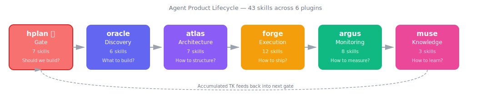
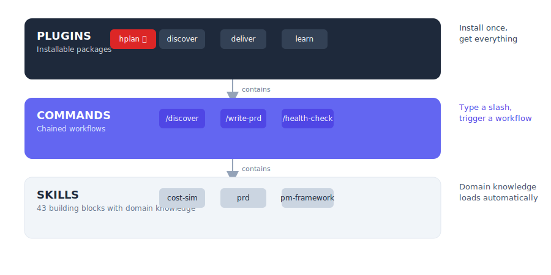

# AI_PM_Skills

> An open-source skillset for PMs who design, build, and operate AI agents as products

[](LICENSE)
[]()
[]()
[](CONTRIBUTING.md)
[](README-ko.md)

<p align="center">
  
</p>

```bash
/discover customer support workflow to automate
/architecture multi-language FAQ + escalation agent
/write-prd customer support auto-response agent
/health-check support agent weekly review
/extract "80% of customers who say 'urgent' aren't actually urgent"
```

---

## The Problem This Project Solves

In 2026, PMs are being asked to "build an agent" — but existing PM skills don't prepare you for that.

General PM skills teach you to **use AI as a tool** — write PRDs faster, generate OKRs, analyze competitors. But when you're **building agents as products**, the questions are fundamentally different:

- "What would it cost to run this agent at 1,000 users/day?"
- "How does an agent recover from hallucination?"
- "How do I orchestrate multiple agents together?"
- "How do I encode 3 months of operational judgment into the agent's instructions?"

This project turns those questions into skills.

---

## What Makes This Different?

### 1. Skills Built for Agent Building

Where general PM skills cover "how to write a good PRD," this skillset covers "how to spec failure recovery, context window management, and tool permissions in an agent PRD." Every skill addresses the decisions agent-building PMs actually face — multi-agent orchestration, model routing, memory architecture, cost scaling.

### 2. Validate Before Building, Reference While Building

| Tool | What it does |
|------|-------------|
| **Build vs Buy** | Compare build-vs-buy across 6 axes before committing |
| **Reliability/Ethics 4-Axis Validation** | Validate reliability and ethics assumptions, not just value |
| **Human-in-the-Loop Design** | Draw the boundary between agent autonomy and human intervention |
| **Token Cost Simulation** | Project monthly costs at 10 → 100 → 1,000 user scale |
| **4-Axis Pre-Impl Review** | Final checkpoint before coding — value, feasibility, reliability, ethics + Mermaid visualization |
| **Image Gen Pipeline** | Reference architecture for building Gemini-based image generation agents |

### 3. Tacit Knowledge That Accumulates

Most skills are one-shot — use them and move on. The `muse` plugin is different. It structures your operational judgment into TK (Tacit Knowledge) units, then injects them into agent instructions. The more you use it, the smarter your agents get — and that knowledge stays yours.

### 4. Claude Spec Compliance

```
marketplace.json          ← Claude Code marketplace schema
evals/evals.json          ← Quality evals (10 tests, 54 assertions)
evals/trigger-evals.json  ← Trigger accuracy evals (96 queries)
evals/per-skill/*.json    ← Per-skill evals
plugin.json (×5)          ← Plugin manifests
```

Full compliance with Claude Code's official spec — marketplace JSON schema, plugin manifests, and eval system. Automated structure validation via `validate_plugins.py`.

### 5. MCP vs Skills Layer Guide

When building agents, the question always comes up: "Should this be an MCP server or a skill?" This skillset guides the architectural decision of how to divide external API connections (MCP) and domain knowledge (Skills) at design time.

### 6. v1.0 Structural Rigor

Every skill follows a consistent v1.0 structure: **Core Goal → Trigger Gate → Failure Handling → Quality Gate → Examples**. The Trigger Gate (Use / Route / Boundary) ensures the right skill fires for the right task. The Failure Handling table covers detection and fallback for each failure mode. The Quality Gate is a self-check before delivery. This isn't formatting — it's the difference between a prompt and a production-grade skill.

---

## How It Works

<p align="center">
  
</p>

**Skills** are building blocks. Describe your task, and the matching skill loads automatically.

**Commands** chain multiple skills into workflows. Type `/write-prd` and it runs research → architecture → spec writing in sequence.

**Plugins** are installable packages. Install one or all five.

```
Plugin (oracle)
  ├── Skills: opp-tree, assumptions, build-or-buy, hitl, cost-sim, agent-gtm
  └── Commands: /discover, /validate
```

> Skills are standard SKILL.md files — they work with Gemini CLI, Cursor, Codex CLI, and Kiro too.

---

## File Structure

```
AI_PM_Skills/
├── .claude-plugin/
│   └── marketplace.json              # Marketplace registration
│
├── oracle/                           # Discovery — What agent to build?
│   ├── .claude-plugin/plugin.json
│   ├── skills/
│   │   ├── opp-tree/SKILL.md         #   Opportunity Solution Tree
│   │   ├── assumptions/SKILL.md      #   4-axis assumption validation
│   │   ├── build-or-buy/SKILL.md     #   Build vs Buy decision
│   │   ├── hitl/SKILL.md             #   Human-in-the-Loop scope
│   │   ├── cost-sim/SKILL.md         #   Token cost simulation
│   │   └── agent-gtm/SKILL.md        #   Go-to-Market strategy
│   └── commands/
│       ├── discover.md               #   /discover
│       └── validate.md               #   /validate
│
├── atlas/                            # Architecture — How to structure it?
│   ├── .claude-plugin/plugin.json
│   ├── skills/
│   │   ├── 3-tier/SKILL.md           #   3-tier multi-agent design
│   │   ├── orchestration/SKILL.md    #   Orchestration patterns
│   │   ├── biz-model/SKILL.md        #   Revenue model design
│   │   ├── router/SKILL.md           #   LLM model routing
│   │   ├── memory-arch/SKILL.md      #   Memory architecture
│   │   ├── moat/SKILL.md             #   Competitive moat analysis
│   │   └── growth-loop/SKILL.md      #   Data flywheel design
│   └── commands/
│       ├── architecture.md           #   /architecture
│       └── strategy-review.md        #   /strategy-review
│
├── forge/                            # Execution — How to spec and ship it?
│   ├── .claude-plugin/plugin.json
│   ├── skills/
│   │   ├── instruction/SKILL.md      #   7-element instruction design
│   │   ├── prd/SKILL.md              #   Agent-specific PRD
│   │   ├── prompt/SKILL.md           #   PM-perspective prompt (CRISP)
│   │   ├── ctx-budget/SKILL.md       #   Context window budget
│   │   ├── okr/SKILL.md              #   Agent OKR
│   │   ├── stakeholder-map/SKILL.md  #   Stakeholder mapping
│   │   ├── agent-plan-review/SKILL.md#   4-axis pre-impl review
│   │   ├── gemini-image-flow/SKILL.md#   Image generation pipeline
│   │   ├── infographic-gif-creator/SKILL.md  # Animated infographic creation
│   │   ├── pptx-ai-slide/SKILL.md     #   Agent presentation deck
│   │   └── agent-demo-video/SKILL.md   #   Remotion-based demo video
│   └── commands/
│       ├── write-prd.md              #   /write-prd
│       ├── set-okr.md                #   /set-okr
│       └── sprint.md                 #   /sprint
│
├── argus/                            # Monitoring — How to measure and improve?
│   ├── .claude-plugin/plugin.json
│   ├── skills/
│   │   ├── kpi/SKILL.md              #   Operational + business KPIs
│   │   ├── reliability/SKILL.md      #   Reliability audit
│   │   ├── premortem/SKILL.md        #   Failure mode analysis (FMEA)
│   │   ├── burn-rate/SKILL.md        #   Cost tracking/optimization
│   │   ├── north-star/SKILL.md       #   North Star Metric
│   │   ├── agent-ab-test/SKILL.md    #   A/B test design
│   │   ├── cohort/SKILL.md           #   Cohort analysis
│   │   └── incident/SKILL.md         #   Incident response protocol
│   └── commands/
│       ├── health-check.md           #   /health-check
│       └── cost-review.md            #   /cost-review
│
├── muse/                             # Knowledge — Turn PM tacit knowledge into agent assets
│   ├── .claude-plugin/plugin.json
│   ├── skills/
│   │   ├── pm-framework/SKILL.md     #   TK-NNN classification
│   │   ├── pm-decision/SKILL.md      #   Decision patterns
│   │   └── pm-engine/SKILL.md        #   PM-ENGINE-MEMORY
│   └── commands/
│       ├── extract.md                #   /extract
│       ├── decide.md                 #   /decide
│       └── tk-to-instruction.md      #   /tk-to-instruction
│
├── evals/                            # Eval system
│   ├── evals.json                    #   Quality evals (10 tests, 54 assertions)
│   ├── trigger-evals.json            #   Trigger accuracy (96 queries)
│   └── per-skill/                    #   Per-skill evals
│
├── eval-workspace/                   # Eval results + benchmarks
├── docs/images/                      # Diagrams, screenshots
├── validate_plugins.py               # Automated structure validation
├── GUIDE-ko.md                       # Scenario-based usage guide (KO)
├── CONTRIBUTING.md                   # Contribution guide
└── LICENSE                           # MIT
```

---

## Installation

### Claude Cowork (GUI — no CLI needed)

1. Open **Cowork** and start a new session
2. Click **Plugins** in the sidebar
3. Search for `AI_PM_Skills`
4. Click **Install** — all 5 plugins are added at once

<!-- TODO: Add installation GIF after GitHub upload -->
<!--  -->

### Claude Code (CLI)

```bash
# Marketplace install (all 5 plugins at once)
claude plugin marketplace add kimsanguine/AI_PM_Skills

# Or install individually
claude plugin add oracle/    # Discovery
claude plugin add atlas/     # Architecture
claude plugin add forge/     # Execution
claude plugin add argus/     # Monitoring
claude plugin add muse/      # Knowledge
```

Not sure which agent to build yet? → Start with `oracle`.
Already know what to build? → Start with `forge`.

### Other AI Tools

| Tool | Skills | Commands | How to use |
|------|:------:|:--------:|-----------|
| **Gemini CLI** | ✅ | ⚠️ Manual | Copy to `.gemini/skills/` |
| **Cursor** | ✅ | ⚠️ Manual | Copy to `.cursor/skills/` |
| **Codex CLI** | ✅ | ⚠️ Manual | Copy to `.codex/skills/` |
| **Kiro** | ✅ | ⚠️ Manual | Copy to `.kiro/skills/` |

```bash
# Copy all skills to another tool
for plugin in oracle atlas forge argus muse; do
  cp -r "$plugin/skills/"* ~/.gemini/skills/ 2>/dev/null
done
```

---

## Plugins

<details>
<summary><strong>1. oracle</strong> — What agent to build? <code>(6 skills, 2 commands)</code></summary>

| Skill | What it does | When to use |
|-------|-------------|-------------|
| `opp-tree` | Opportunity Solution Tree | "What should we automate?" |
| `assumptions` | 4-axis validation (Value/Feasibility/Reliability/Ethics) | "Should we really build this?" |
| `build-or-buy` | Build vs buy decision | "Buy a solution or build our own?" |
| `hitl` | Human-in-the-Loop scope | "Where does the human step in?" |
| `cost-sim` | Token cost simulation | "How much per month?" |
| `agent-gtm` | Go-to-Market strategy | "How do we launch this?" |

**Commands:** `/discover` · `/validate`

**Examples:**
```
"Is it worth building an agent to automate customer onboarding?"
→ build-or-buy skill auto-loads

/discover customer support workflow
→ opportunity mapping → assumption check → feasibility scoring
```

</details>

<details>
<summary><strong>2. atlas</strong> — How to architect it? <code>(7 skills, 2 commands)</code></summary>

| Skill | What it does | When to use |
|-------|-------------|-------------|
| `3-tier` | 3-tier multi-agent design (Prometheus-Atlas-Worker) | "How do I wire multiple agents together?" |
| `orchestration` | Orchestration pattern selection | "Sequential? Parallel? Router?" |
| `biz-model` | Revenue model design | "How do we monetize this?" |
| `router` | Per-task LLM model selection | "Haiku for this? Sonnet? Opus?" |
| `memory-arch` | Memory architecture design | "How do we manage conversation history?" |
| `moat` | Competitive moat analysis | "What if competitors copy us?" |
| `growth-loop` | Data flywheel design | "How does it get smarter with use?" |

**Commands:** `/architecture` · `/strategy-review`

**Examples:**
```
"This agent handles 5 task types — what architecture should I use?"
→ orchestration skill auto-loads

/architecture multi-step document processing pipeline
→ pattern selection → tier structure → memory architecture
```

</details>

<details>
<summary><strong>3. forge</strong> — How to spec and ship it? <code>(11 skills, 3 commands)</code></summary>

| Skill | What it does | When to use |
|-------|-------------|-------------|
| `instruction` | 7-element instruction design | "What do I tell the agent?" |
| `prd` | Agent-specific PRD | "What format for the spec?" |
| `prompt` | PM-perspective prompt design (CRISP) | "How do I write better prompts?" |
| `ctx-budget` | Context window budget | "How to split 128K tokens?" |
| `okr` | Agent OKR | "What does success look like?" |
| `stakeholder-map` | Stakeholder mapping | "Who's for it, who's against it?" |
| `agent-plan-review` | 4-axis pre-implementation review + Mermaid | "Sanity check before coding" |
| `gemini-image-flow` | Image generation pipeline | "How to build an image gen agent?" |
| `infographic-gif-creator` | Animated infographic GIF/MP4 | "Visualize this architecture as an animation" |
| `pptx-ai-slide` | Agent presentation deck | "Make a pitch deck for this agent" |
| `agent-demo-video` | Remotion-based demo video | "Create a demo video for stakeholders" |

**Commands:** `/write-prd` · `/set-okr` · `/sprint`

**Examples:**
```
"Write the PRD for a meeting summarizer agent"
→ prd skill loads (includes failure recovery, context management, tool permissions)

/write-prd customer support escalation agent
→ requirements → instruction design → full agent PRD
```

</details>

<details>
<summary><strong>4. argus</strong> — How to measure and improve? <code>(8 skills, 2 commands)</code></summary>

| Skill | What it does | When to use |
|-------|-------------|-------------|
| `kpi` | Operational + business KPIs | "What metrics should I track?" |
| `reliability` | Reliability audit | "The agent gives wrong answers" |
| `premortem` | Failure mode analysis (FMEA) | "What could blow up at launch?" |
| `burn-rate` | Cost tracking/optimization | "Why did costs spike?" |
| `north-star` | North Star Metric | "What's the ultimate success metric?" |
| `agent-ab-test` | A/B test design | "Is the prompt change actually better?" |
| `cohort` | Cohort analysis | "How does performance change over versions?" |
| `incident` | Incident response protocol | "The agent is down — what do we do?" |

**Commands:** `/health-check` · `/cost-review`

**Examples:**
```
"Token costs jumped 40% this week — what happened?"
→ burn-rate skill loads (cost analysis + optimization)

/health-check onboarding agent
→ KPI review → reliability check → cost anomaly detection → weekly summary
```

</details>

<details>
<summary><strong>5. muse ⭐</strong> — Turn PM tacit knowledge into agent assets <code>(3 skills, 3 commands)</code></summary>

| Skill | What it does | When to use |
|-------|-------------|-------------|
| `pm-framework` | TK-NNN tacit knowledge classification | "I want to structure my experience" |
| `pm-decision` | 6 core PM decision patterns | "How should I decide in this situation?" |
| `pm-engine` | PM-ENGINE-MEMORY interface | "Inject my accumulated TK into agents" |

**Commands:** `/extract` · `/decide` · `/tk-to-instruction`

**Examples:**
```
/extract "When reviewing agent PRDs, I always check if failure mode covers hallucination recovery"
→ capture TK → classify → link to knowledge graph

/tk-to-instruction onboarding agent
→ find relevant TK units → translate to agent instructions
```

> The framework is open-source; your data (PM-ENGINE-MEMORY.md) is your own asset.

</details>

---

## Benchmark

10 tests with 54 assertions measure what the skills actually add on top of base Claude.

| | With Skill | Without Skill | Delta |
|---|-----------|--------------|-------|
| **Pass Rate** | **100%** | 88% | **+12%** |
| **Avg Time** | 62s | 42s | +20s |

- **Capability-gating** — without the skill, Claude can't do it at all. `pm-framework` (TK structuring) drops to 40%, `3-tier` (multi-agent design) drops to 60-80%.
- **Quality-amplifying** — both pass, but the skill produces deeper output. `cost-sim` adds +46.6% output, `premortem` generates 2× more failure modes.
- **Agent-specific** — `prd` and `premortem` pass either way, but with-skill output follows agent-specific templates instead of generic PM structures.

Full data: [`eval-workspace/iteration-1/benchmark.json`](eval-workspace/iteration-1/benchmark.json)

> **Note:** Benchmark was measured on 32 skills (v0.4). Re-measurement with 35 skills and v1.0 structure is planned for the next iteration.

---

## Skill Origin

| Type | Count | Description |
|------|-------|-------------|
| 🟢 Adapted | 3 | Classic PM frameworks (OST, FMEA), recontextualized for agents |
| 🟡 Extended | 6 | Standard PM concepts, heavily extended with agent-specific dimensions |
| 🔴 New | 26 | Agent-only domains — cost-sim, 3-tier, TK-NNN, moat, reliability, growth-loop, etc. |

**74% is original work.**

---

## Status

**v1.0** — All 5 plugins complete (35 skills, 12 commands) with v1.0 structural upgrade

| Plugin | Skills | Commands | Trigger Accuracy | Status |
|--------|--------|----------|-----------------|--------|
| oracle | 6 | 2 | 18/20 (90%) | ✅ |
| atlas | 7 | 2 | 24/24 (100%) | ✅ |
| forge | 11 | 3 | 20/20 (100%) | ✅ |
| argus | 8 | 2 | 20/20 (100%) | ✅ |
| muse | 3 | 3 | 12/12 (100%) | ✅ |
| **Total** | **35** | **12** | **94/96 (97.9%)** | |

---

## Contributing

See [CONTRIBUTING.md](CONTRIBUTING.md) for guidelines. New skills, improvements, and translations (EN↔KO) are all welcome.

---

## Author

**Sanguine Kim** — 20-year PM, AI Agent Builder

References & inspiration:
- Teresa Torres — *Continuous Discovery Habits*
- Anthropic — "Building Effective Agents"
- Steve Yegge — Gas Town parallel agent design principles
- Byeonghyeok Kwak — MCP-Skills hierarchy design principles
- Michael Polanyi — *The Tacit Dimension*

---

## Related

| Repo | What | Link |
|------|------|------|
| **AI_PM** | Claude Code guide for PMs — learn the why and how | [github.com/kimsanguine/AI_PM](https://github.com/kimsanguine/AI_PM) |
| **AI_PM_Skills** | Ready-to-use agent skillset — the tools *(this repo)* | [github.com/kimsanguine/AI_PM_Skills](https://github.com/kimsanguine/AI_PM_Skills) |

> **AI_PM** teaches the thinking. **AI_PM_Skills** gives you the tools.

---

## License

MIT — [LICENSE](LICENSE)
