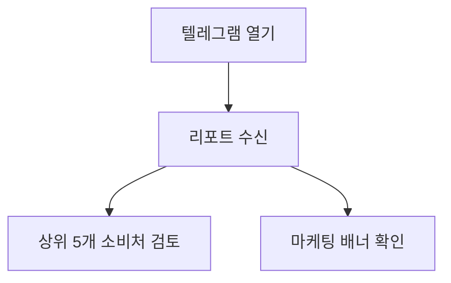

# Bad Example — Mermaid 정합성 실패 PRD

> 노드가 따로 놀고, 요구사항 한 개가 어디에도 그려지지 않음.
> 검증기가 차단해야 하는 전형 케이스.

---

## Requirements

- 비용 데이터 수집
- 상위 5개 비용 소비처 식별
- 절감 권고 생성
- 텔레그램 리포트 전송
- 이상 비용 감지 시 즉시 알림

---

## Workflow (System View)


## Userflow (User View)



---

## 검증 결과 (예상)

```
⚠️  workflow에만 있는 노드 (1):
     - C: 내부 캐시 갱신
⚠️  userflow에만 있는 노드 (1):
     - U4: 마케팅 배너 확인
❌ 다이어그램에 매핑되지 않은 요구사항 (1):
     - 이상 비용 감지 시 즉시 알림
```

**왜 차단되는가:**
1. `내부 캐시 갱신`은 유저 가치 없는 시스템 작업 → 정말 필요한가 재검토
2. `마케팅 배너 확인`은 구현 없는 유저 약속 → workflow 누락이거나 over-promise
3. 요구사항 "이상 비용 감지 시 즉시 알림"이 두 다이어그램에 없음 → **빌드 차단**

**복구 절차:**
- 요구사항 누락 → 두 다이어그램에 모두 노드 추가
- orphan → 진짜 필요한지 재검토 후 (a) 양쪽에 추가하거나 (b) 삭제
