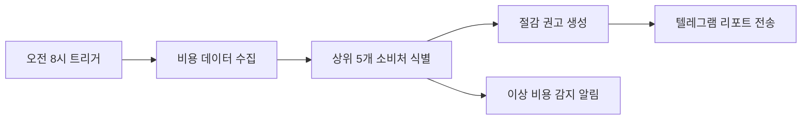
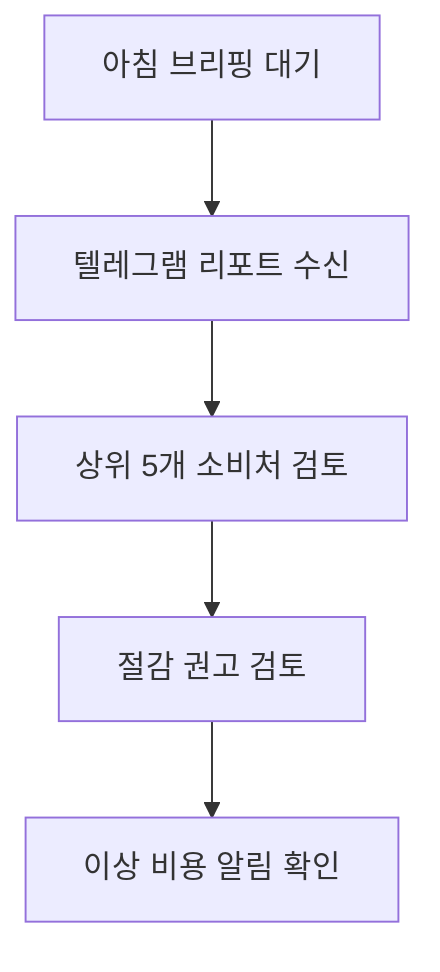

# Good Example — Mermaid 정합성 통과 PRD

> `validate-mermaid.py` 결정론 검증을 통과하는 최소 패턴.
> workflow ↔ userflow ↔ requirements 세 축이 의미 토큰으로 매핑된다.
>
> **노하우**: 세 축의 **언어와 핵심 명사를 일치**시킨다.
> 요구사항이 한국어면 다이어그램 라벨도 한국어로 작성하면 검증기 매칭률이 급상승한다.

---

## Requirements

- 매일 오전 8시 비용 데이터 수집
- 상위 5개 비용 소비처 식별
- 절감 권고 생성
- 텔레그램 리포트 전송
- 이상 비용 감지 시 즉시 알림

---

## Workflow (System View)



## Userflow (User View)



---

## 검증 결과 (예상)

```
📊 PRD 정합성 검증: PRD.md
   workflow 노드 6개 · userflow 노드 5개 · requirements 5개
✅ 정합성 통과: workflow ↔ userflow ↔ requirements 매핑 일관
```

**왜 통과하는가:**
- 요구사항 "비용 데이터 수집" ↔ workflow `비용 데이터 수집` ↔ userflow `텔레그램 리포트 수신`(파생 출력)
- 토큰 셋 자카드가 임계치(34%)를 넘는 모든 쌍이 매핑된다
