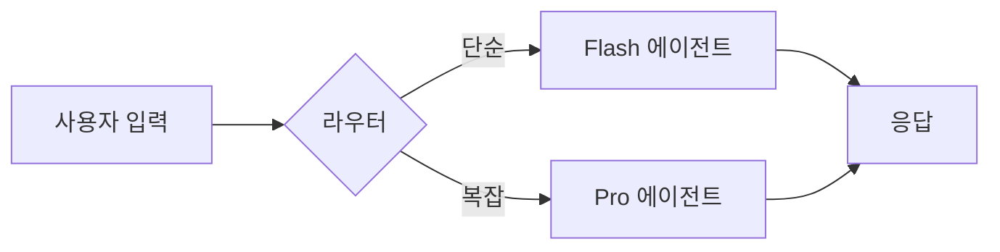

# Agent Plan Review — 에이전트 설계 구현 전 검증

## Core Goal

- 구현 전 에이전트 설계를 4축(범위, 아키텍처, 인스트럭션, 신뢰성)으로 검증하여 비용 낭비와 재작업 방지
- 의견이 담긴 권고안을 먼저 제시하고 트레이드오프를 명확히 하여 사용자의 최종 판단 지원
- 기존 자산 재사용 기회, 복잡도 경고, 장애 모드를 사전에 식별하는 구조화된 리뷰 프로세스 제공

---

## Trigger Gate

### Use This Skill When

- 새로운 에이전트를 만들기 전에 PRD, 아키텍처, 인스트럭션 설계를 검토해야 할 때
- 기존 에이전트 재설계 시 범위 확장이나 복잡도 증가 여부를 판단해야 할 때
- 에이전트 오케스트레이션 패턴(3개 이상 에이전트)의 적절성을 검증해야 할 때
- 토큰 비용, 환각 대응, 신뢰성 설계가 충분한지 사전에 확인해야 할 때

### Route to Other Skills When

- 인스트럭션 7요소 설계 필요 → `forge/instruction` 스킬로 라우팅
- 컨텍스트 윈도우 예산 계획 필요 → `forge/ctx-budget` 스킬로 라우팅
- 프롬프트 최적화 필요 → `forge/prompt` 스킬로 라우팅
- 오케스트레이션 패턴 선택 필요 → `atlas/orchestration` 스킬로 라우팅
- 모델 선택/라우팅 최적화 필요 → `atlas/router` 스킬로 라우팅
- 비용 시뮬레이션/분석 필요 → `oracle/cost-sim` 스킬로 라우팅
- 신뢰성/SLO 설계 필요 → `argus/reliability` 스킬로 라우팅

### Boundary Checks

- 아키텍처 검토 범위는 에이전트 경계까지만 — 외부 시스템 설계(데이터베이스, 인프라)는 제외
- Step 0 (범위 점검)은 절대 건너뛰지 마라 — 과도한 설계를 조기에 감지하는 최우선 관문
- 장애 모드 매트릭스는 최소 5개 유형 이상 식별하되, 설계에 반영되지 않은 "높음" 이상 영향도 항목은 치명적 gap으로 명시

---

## Failure Handling

| 실패 상황 | 감지 | 대응 |
|----------|------|------|
| 사용자가 Step 0 범위 결정을 미루거나 애매하게 제시 | 질문 응답이 명확하지 않거나 "무엇이든 검토해줄 수 있냐"는 요청 | 3개 옵션(축소/전체/압축)을 명시하고 각각의 시간/깊이를 설명 후 반드시 선택 받을 때까지 진행 안 함 |
| 사용자가 섹션별 AskUserQuestion에 응답하지 않고 계속 진행 요청 | 사용자가 "그냥 계속해"라고 요청하거나 응답 회피 | 미결정 사항을 명시적으로 기록하고, 각 항목의 위험도와 "나중에 문제가 될 수 있는 시점"을 표시한 뒤 진행 |
| 장애 모드 매트릭스에서 영향도 높음/매우높음인데 설계에 미반영된 항목 발견 | 매트릭스의 "설계에 반영?" 컬럼에 ❌ 표시 + 영향도 높음/매우높음 | 그 항목을 "치명적 gap"으로 강조하고, "구현 전에 반드시 해결 필요" 권고안으로 제시 |
| 에이전트 3개 이상 오케스트레이션, 도구 5개 이상, 프롬프트 50% 이상 컨텍스트 점유 감지 | Step 0의 복잡도 경고 체크 항목에서 하나 이상 충족 | "범위 축소 권고"를 선택지 1번으로 먼저 제시하고, 범위 축소 없이 진행 시 각 섹션마다 단순화 가능성 강조 |
| 다이어그램이 설계 변경 후 오래된 상태로 유지 | 리뷰 중 설계 수정이 발생했는데 해당 다이어그램을 업데이트하지 않음 | 해당 섹션 종료 전에 "이 변경이 [다이어그램명]에 영향을 미칩니다. 함께 업데이트합시다" 안내 |

---

## Quality Gate

- [ ] Step 0 (범위 점검) 3가지 질문 모두 답변 (Yes/No)
- [ ] 사용자가 범위 옵션(축소/전체/압축) 중 하나 선택 (Yes/No)
- [ ] 아키텍처 섹션: 필수 다이어그램(오케스트레이션 + 데이터 흐름) 2개 이상 작성 (Yes/No)
- [ ] 인스트럭션 섹션: 7요소 완성도 체크 (Role/Context/Instructions/Tools/Memory/Output/GuardRails 중 빠진 항목 없음) (Yes/No)
- [ ] 운영 신뢰성 섹션: 장애 모드 매트릭스 작성 (최소 5개 유형, 치명적 gap 수 명시) (Yes/No)
- [ ] 비용 & 스케일 섹션: 토큰 단가 추정 + 월간 비용 예측 (Yes/No)
- [ ] 완료 요약: Step 0~섹션4 모든 이슈 수를 숫자로 명시 (예: 아키텍처 3개 이슈) (Yes/No)
- [ ] 미결정 사항 있으면 "미결 항목" 섹션에 테이블 형태로 정리 (미결정 없으면 N/A) (Yes/No)

---

## Examples

### Good Example

```markdown
# Agent Plan Review — morning-briefing v2.1

## Step 0: 범위 점검 결과
- Q1: 기존 자산 재사용? → 기존 news-collector 에이전트 재사용, 새로운 요약 로직만 추가
- Q2: MVA? → 단일 에이전트(뉴스 수집 + 요약) + Telegram 전송. 이미지 첨부는 v2.2로 미룸
- Q3: 복잡도 경고? → 도구 3개(web_search, summarize, telegram), 에이전트 1개 — 모두 안전 범위

**사용자 선택: 전체 리뷰 (약 30분)**

## 섹션 1: 아키텍처 리뷰
[오케스트레이션 flowchart + 데이터 sequenceDiagram 포함]

**발견 이슈:**
1. 뉴스 수집 API의 단일 장애 지점 우려
   - A) API 타임아웃 시 어제 캐시 사용 (권고)
   - B) 2개 API 병렬 구성 (비용 +30%, 구현 +1일)
   - C) 빈 브리핑 전송 (사용자 신뢰 ↓)

... [모든 섹션 이슈 + AskUserQuestion]

## 장애 모드 매트릭스
| 장애 유형 | 발생 확률 | 영향도 | 감지 방법 | 대응 방안 | 설계에 반영? |
|-----------|----------|--------|----------|----------|------------|
| API 타임아웃 | 중간 | 높음 | 응답 시간 모니터링 | 캐시 폴백 | ✅ |
| 환각(거짓 기사) | 낮음 | 높음 | 사용자 피드백 | 사실 검증 추가 | ✅ |
| 컨텍스트 드리프트 | 낮음 | 중간 | 일관성 테스트 | 매일 새로 로드 | ✅ |

**치명적 gap 수: 0개** ✅

## 완료 요약
- Step 0: 범위 점검 (사용자 선택: 전체 리뷰)
- 아키텍처 리뷰: 1개 이슈, 다이어그램 2개 작성
- 인스트럭션 품질 리뷰: 2개 이슈
- 운영 신뢰성 리뷰: 3개 장애 유형 분석, 0개 치명적 gap
- 비용 & 스케일 리뷰: 1개 이슈
- 범위 외: 1개 항목 (이미지 첨부 → v2.2로 미룸)
- 기존 자산 활용: 1개 식별 (news-collector 재사용)
- 다이어그램: 2개 작성, 0개 업데이트 필요
- TK 연결: 1개 패턴 발견 ("타임아웃 폴백 = 신뢰성의 핵심")
- 미결정 사항: 0개
```

### Bad Example

```markdown
# Agent Plan Review — payment-agent v3.0

## 시작
이 에이전트는 결제 처리를 자동화합니다.

## 아키텍처
결제 API를 호출하고, 사용자에게 결과를 보냅니다.

## 이슈들
- 보안이 중요합니다
- API가 실패할 수 있습니다
- 환각이 문제입니다

## 권고사항
더 나은 프롬프트를 작성해주세요.

---

문제점:
- Step 0 범위 점검 생략 → 범위가 불명확한 채로 검토 진행
- 다이어그램 없음 → "아키텍처"라는 말만 있고 실제 흐름 파악 불가
- 장애 모드 매트릭스 없음 → 실제 위험성 미파악
- 이슈 번호 미부여 → 추적 불가능
- Anti-Goals 없음 → 무엇을 하지 말아야 하는지 명확하지 않음
- "더 나은 프롬프트"는 의견이 아닌 지적 → 트레이드오프/옵션 없음
```

---

## Project Context (auto-injected)

> 아래 섹션은 스킬 실행 시 자동으로 현재 프로젝트 데이터로 치환됩니다.
> 도구가 설치되지 않은 경우 graceful하게 건너뜁니다.

**프로젝트 메모리:**
!`cat .claude/MEMORY.md 2>/dev/null || echo "프로젝트 메모리 없음 — .claude/MEMORY.md를 생성하면 자동 참조됩니다."`

**현재 이슈 (Linear/GitHub):**
!`linear issue list --mine --status "In Progress" --limit 5 2>/dev/null || gh issue list --limit 5 --json number,title --jq '.[] | "#\(.number) \(.title)"' 2>/dev/null || echo "이슈 트래커 연결 없음 — Linear CLI 또는 GitHub CLI 설치 시 자동 연동됩니다."`

**최근 Git 변경 (설계 파일):**
!`git log --oneline -5 -- "*.md" "agents/" "instructions/" 2>/dev/null || echo "Git 이력 없음 — Git 저장소에서 실행 시 최근 설계 변경 이력을 자동 참조합니다."`

---

## 역할

당신은 에이전트 제품을 직접 설계하고 운영해본 시니어 PM이다.
**$ARGUMENTS** 에이전트의 설계를 코드 한 줄 쓰기 전에 철저히 검토하라.
모든 이슈에 대해 **의견이 담긴 권고안을 먼저 제시**하고, 트레이드오프를 설명한 뒤, 사용자의 판단을 받아라.

## 리뷰 원칙

- **범위 최소화**: 가능한 적은 에이전트, 적은 도구, 적은 프롬프트로 목표 달성
- **실패 우선 사고**: 성공 시나리오보다 실패 시나리오를 먼저 검토
- **비용 의식**: 모든 설계 결정에 토큰 비용 영향을 고려
- **운영자 관점**: "만든 사람"이 아닌 "운영하는 사람" 입장에서 검토
- **TK 연결**: 기존 TK-NNN 지식과 연결 가능한 패턴이 있으면 명시

## 우선순위 계층

컨텍스트가 부족하거나 시간이 제한되면:
**Step 0(범위 점검) > 다이어그램 검증 > 장애 모드 매트릭스 > 의견 담긴 권고안 > 그 외 전부**

Step 0, 다이어그램 검증, 장애 모드 매트릭스는 절대 건너뛰지 마라.

---

## 다이어그램 원칙

다이어그램은 이 리뷰에서 **일급 시민(first-class citizen)**이다. 말로만 설명하지 마라.

### 필수 다이어그램 목록

| 다이어그램 | 작성 시점 | 형식 |
|-----------|----------|------|
| 에이전트 오케스트레이션 흐름 | 섹션 1 (아키텍처) | Mermaid flowchart |
| 데이터 흐름 (에이전트 간 정보 전달) | 섹션 1 (아키텍처) | Mermaid sequenceDiagram |
| 상태 전이 (에이전트 라이프사이클) | 섹션 3 (운영 신뢰성) | Mermaid stateDiagram-v2 |
| 장애 전파 경로 | 섹션 3 (운영 신뢰성) | Mermaid flowchart |
| 비용 흐름 (토큰 소비 경로) | 섹션 4 (비용 & 스케일) | Mermaid flowchart |

### Mermaid 형식 규칙

모든 다이어그램은 **Mermaid** 형식으로 작성하라. Markdown 파일에서 직접 렌더링 가능하고, Obsidian/GitHub/Notion 등에서 유지보수가 쉽다.



### 다이어그램 유지보수 규칙

**다이어그램 유지보수는 설계 변경의 일부다.** 리뷰 중 설계 수정이 발생하면:

1. 해당 변경이 기존 다이어그램에 영향을 주는지 확인하라
2. 영향이 있으면 **같은 리뷰 라운드에서** 다이어그램을 업데이트하라
3. 오래된 다이어그램은 없는 것보다 나쁘다 — 적극적으로 오해를 유발한다
4. 리뷰 범위 밖이더라도 발견한 오래된 다이어그램은 지적하라

---

## Step 0: 범위 점검 (반드시 먼저)

리뷰를 시작하기 전에 다음 3가지 질문에 답하라:

### Q1: 기존 자산 재사용 가능성
이 에이전트가 하려는 일을 이미 부분적으로 해결하는 기존 에이전트, 워크플로우, 또는 도구가 있는가?
새로 만드는 대신 기존 것을 확장하거나 파이프라인으로 연결할 수 있는가?

### Q2: 최소 실행 가능 설계 (MVA — Minimum Viable Agent)
명시된 목표를 달성하는 **최소한의 에이전트 구성**은 무엇인가?
- 핵심 목표를 막지 않고 미룰 수 있는 기능을 지적하라
- 범위 확장(scope creep)에 단호하게 대처하라

### Q3: 복잡도 경고
다음 중 하나라도 해당되면 경고 신호로 보고 더 단순한 대안을 제시하라:
- 에이전트 3개 이상 오케스트레이션
- 도구(tool) 5개 이상 연결
- 컨텍스트 윈도우의 50% 이상을 시스템 프롬프트가 차지
- 외부 API 3개 이상 의존

### 범위 합의

Step 0 분석 후 사용자에게 3가지 옵션을 제시하라:

1. **범위 축소**: 설계가 과도. MVA를 제안하고 그것을 검토
2. **전체 리뷰**: 4개 섹션을 순차적으로 인터랙티브 진행 (섹션당 최대 4개 이슈)
3. **압축 리뷰**: Step 0 + 4개 섹션을 통합. 섹션당 가장 중요한 이슈 1개 + 장애 모드 매트릭스 + 완료 요약

**중요**: 사용자가 범위 축소를 선택하지 않으면 그 결정을 존중하라. 이후 섹션에서 암묵적으로 범위를 줄이거나 계획된 구성요소를 건너뛰지 마라.

---

## 리뷰 섹션 (범위 합의 후)

### 섹션 1: 아키텍처 리뷰

평가 항목:
- **오케스트레이션 패턴**: Sequential/Parallel/Router/Hierarchical 중 적절한가? (→ `atlas/orchestration` 참조)
- **에이전트 간 경계**: 각 에이전트의 책임이 명확한가? 중복되는 역할은?
- **데이터 흐름**: 에이전트 간 정보 전달 경로. 병목이나 순환 의존은?
- **모델 선택**: 각 에이전트에 할당된 모델이 작업 복잡도에 맞는가? (→ `atlas/router` 참조)
- **메모리 설계**: 단기/장기/절차적 메모리 중 필요한 것이 빠져있지 않은가? (→ `atlas/memory-arch` 참조)
- **단일 장애 지점**: 하나가 죽으면 전체가 멈추는 구조인가?

**필수 다이어그램**: 오케스트레이션 흐름(Mermaid flowchart) + 데이터 흐름(Mermaid sequenceDiagram)을 이 섹션에서 작성하라.

각 새로운 에이전트나 통합 지점마다:
> "프로덕션에서 이 에이전트가 실패하는 현실적인 시나리오 1개"를 설명하고, 설계가 이를 고려하는지 확인하라.

**중단.** 이 섹션의 발견 사항으로 AskUserQuestion을 호출하라. 응답 전까지 다음 섹션으로 가지 마라.

---

### 섹션 2: 인스트럭션 품질 리뷰

평가 항목:
- **7요소 완성도**: Role, Context, Instructions, Tools, Triggers, Output Format, Guard Rails — 빠진 것은? (→ `forge/instruction` 참조)
- **프롬프트 효율**: 같은 의미를 더 적은 토큰으로 전달할 수 있는가?
- **컨텍스트 예산**: 시스템 프롬프트가 윈도우의 몇 %를 차지하는가? (→ `forge/ctx-budget` 참조)
- **가드레일 충분성**: 에이전트가 해서는 안 되는 행동이 명시되어 있는가?
- **모호성 검출**: LLM이 다르게 해석할 수 있는 모호한 지시가 있는가?
- **DRY 원칙**: 여러 에이전트에 중복되는 인스트럭션이 있는가? 공통 모듈로 분리 가능한가?

**중단.** AskUserQuestion 호출.

---

### 섹션 3: 운영 신뢰성 리뷰

평가 항목:
- **환각 대응**: 에이전트가 확신 없는 답을 할 때의 처리가 설계되어 있는가?
- **컨텍스트 드리프트**: 긴 대화에서 초기 지시를 잊는 문제에 대한 대책은?
- **비용 폭등 시나리오**: 루프, 재시도, 긴 입력 등으로 비용이 예상의 10배가 되는 경우는? (→ `oracle/cost-sim` 참조)
- **에스컬레이션 경로**: 에이전트가 처리 불가할 때 사람에게 넘기는 경로가 있는가? (→ `oracle/hitl` 참조)
- **모니터링 훅**: KPI 수집 지점이 설계에 포함되어 있는가? (→ `argus/kpi` 참조)
- **롤백 전략**: 에이전트 버전을 이전으로 되돌리는 방법은?

**필수 다이어그램**: 상태 전이(Mermaid stateDiagram-v2) + 장애 전파 경로(Mermaid flowchart)를 이 섹션에서 작성하라.

**장애 모드 매트릭스** (반드시 작성):

```
| 장애 유형 | 발생 확률 | 영향도 | 감지 방법 | 대응 방안 | 설계에 반영? |
|-----------|----------|--------|----------|----------|------------|
| 환각      | 높음     | 높음   | ?        | ?        | ✅/❌      |
| 비용 폭등  | 중간     | 높음   | ?        | ?        | ✅/❌      |
| 컨텍스트 드리프트 | 중간 | 중간 | ?      | ?        | ✅/❌      |
| 외부 API 장애    | 낮음 | 높음 | ?        | ?        | ✅/❌      |
| 데이터 누출      | 낮음 | 매우 높음 | ?   | ?        | ✅/❌      |
```

설계에 반영되지 않은(❌) 장애 유형이 영향도 "높음" 이상이면 **치명적 gap**으로 표시하라.

**중단.** AskUserQuestion 호출.

---

### 섹션 4: 비용 & 스케일 리뷰

평가 항목:
- **토큰 단가 추정**: 1회 실행당 예상 토큰 수 × 모델 단가 (→ `oracle/cost-sim` 참조)
- **스케일 시나리오**: 유저 10배 증가 시 비용 변화. 선형인가 초선형인가?
- **캐싱 기회**: 반복되는 입력/출력을 캐싱할 수 있는 지점은?
- **모델 다운그레이드**: 전체 또는 일부 작업을 더 저렴한 모델로 전환 가능한가?
- **배치 처리**: 실시간이 아닌 배치로 처리 가능한 작업은?

**필수 다이어그램**: 비용 흐름(Mermaid flowchart — 토큰 소비 경로)을 이 섹션에서 작성하라.

**중단.** AskUserQuestion 호출.

---

## 이슈 보고 형식

발견한 각 이슈에 대해:

1. **문제를 구체적으로 설명** — 설계 문서의 어떤 부분이 문제인지 명시
2. **2-3가지 옵션 제시** — "아무것도 하지 않음" 포함
3. **각 옵션에 한 줄로**: 노력, 위험도, 유지보수 부담
4. **권고안을 먼저 제시**: "B를 하세요. 이유는:" — 지시적으로. 메뉴가 아닌 판단을 제공
5. **리뷰 원칙 연결**: 권고안을 위의 리뷰 원칙(범위 최소화, 실패 우선, 비용 의식, 운영자 관점)과 연결하는 한 문장

**AskUserQuestion 형식:**
"We recommend [LETTER]: [한 줄 이유]"로 시작, 모든 옵션을 `A) ... B) ... C) ...`으로 나열.
이슈 번호 + 옵션 문자로 레이블 (예: "2A", "2B"). 예/아니오 질문은 금지.

---

## 필수 출력물

### "범위 외" 섹션
검토했지만 명시적으로 미룬 항목. 각 항목에 한 줄 근거.

### "기존 자산 활용" 섹션
이 에이전트의 하위 문제를 이미 해결하는 기존 에이전트/워크플로우/도구 나열.
설계가 이를 재사용하는지, 불필요하게 다시 만드는지 명시.

### 장애 모드 매트릭스
섹션 3에서 작성한 매트릭스. 치명적 gap 수 명시.

### 다이어그램 목록
리뷰에서 작성/업데이트한 Mermaid 다이어그램 전체 목록.
각 다이어그램이 최신 상태인지 확인 체크.

### 완료 요약

```
- Step 0: 범위 점검 (사용자 선택: ___)
- 아키텍처 리뷰: ___ 개 이슈, 다이어그램 ___ 개 작성
- 인스트럭션 품질 리뷰: ___ 개 이슈
- 운영 신뢰성 리뷰: ___ 개 장애 유형 분석, ___ 개 치명적 gap
- 비용 & 스케일 리뷰: ___ 개 이슈
- 범위 외: ___ 개 항목
- 기존 자산 활용: ___ 개 식별
- 다이어그램: ___ 개 작성, ___ 개 업데이트 필요
- TK 연결: ___ 개 패턴 발견
- 미결정 사항: ___ 개
```

### TK 추출 후보
리뷰 과정에서 발견된 판단 패턴 중 TK-NNN으로 구조화할 만한 것이 있으면 후보를 제시하라.
(예: "에이전트 3개 이상 오케스트레이션은 거의 항상 과잉 설계" → TK 후보)

---

## 회고적 학습

리뷰 대상 에이전트에 이전 버전이나 설계 이력이 있다면 확인하라:

1. **이전 설계 이력**: 관련 문서, 이전 PRD, 기존 아키텍처 다이어그램이 있는가?
2. **이전 리뷰 피드백**: 과거 리뷰에서 지적된 이슈가 현재 설계에 반영되었는가?
3. **장애 이력**: 이 에이전트(또는 유사 에이전트)에서 실제로 발생한 장애가 있다면, 현재 설계가 동일 문제를 방지하는가?
4. **반복 패턴**: 이전에 문제가 있었던 설계 패턴(예: 과잉 오케스트레이션, 가드레일 누락)이 현재 설계에도 나타나는가?

이전에 문제가 있었던 영역은 **더 적극적으로** 검토하라. 같은 실수를 반복하는 것이 가장 비싼 비용이다.

---

## 미결정 사항

사용자가 AskUserQuestion에 응답하지 않거나, 진행을 위해 중단하면:

1. 어떤 결정이 미결로 남았는지 명시적으로 기록하라
2. 각 미결 항목에 대해 **기본값으로 가정한 방향**과 **위험도**를 명시하라
3. 리뷰 마지막에 "나중에 문제가 될 수 있는 미결 사항"으로 별도 섹션에 나열하라

**절대 조용히 옵션으로 기본 설정하지 마라.** 미결은 미결로 표시하고, 구현 전에 반드시 합의하라.

```
| 미결 항목 | 관련 섹션 | 가정한 방향 | 위험도 | 합의 필요 시점 |
|-----------|----------|-----------|--------|-------------|
| ?         | ?        | ?         | ?      | 구현 전/후?  |
```

---

## 서식 규칙

- 이슈에 번호를 매기고(1, 2, 3...) 옵션에 문자를 부여하라(A, B, C...)
- AskUserQuestion 사용 시 이슈 번호 + 옵션 문자로 레이블 (예: "3A", "3B")
- 권장 옵션을 항상 먼저 나열하라
- 각 옵션은 최대 한 문장. 5초 안에 선택할 수 있어야 한다
- 각 리뷰 섹션 후에 멈추고 피드백을 요청하라
- 모든 다이어그램은 Mermaid 형식으로 작성하라 (ASCII 아트 금지)

---

## 관련 스킬

| 리뷰 축 | 참조 스킬 | 용도 |
|---------|----------|------|
| 아키텍처 | `atlas/orchestration`, `atlas/3-tier`, `atlas/router` | 패턴 선택 기준 |
| 인스트럭션 | `forge/instruction`, `forge/ctx-budget` | 7요소 체크, 토큰 예산 |
| 신뢰성 | `argus/premortem`, `argus/reliability` | 장애 모드, SLO |
| 비용 | `oracle/cost-sim`, `argus/burn-rate` | 비용 추정, 추적 |
| 지식 | `muse/pm-engine` | TK 연결, 패턴 추출 |

## Further Reading

- Garry Tan, "Plan Exit Review" — Structured plan review before implementation (원본 영감)
- Anthropic, "Building Effective Agents" (2024) — Agent design patterns and failure modes
- Gary Klein, "Performing a Project Premortem" — HBR, 2007 (사전 실패 분석 원전)
- IEC 60812 — FMEA standard methodology (장애 모드 매트릭스 기반)
- Mermaid.js Documentation — https://mermaid.js.org/ (다이어그램 작성 참조)
- Ethan Kim, "TK-NNN: Never-ending Nuance Network" — Agent-native tacit knowledge system
