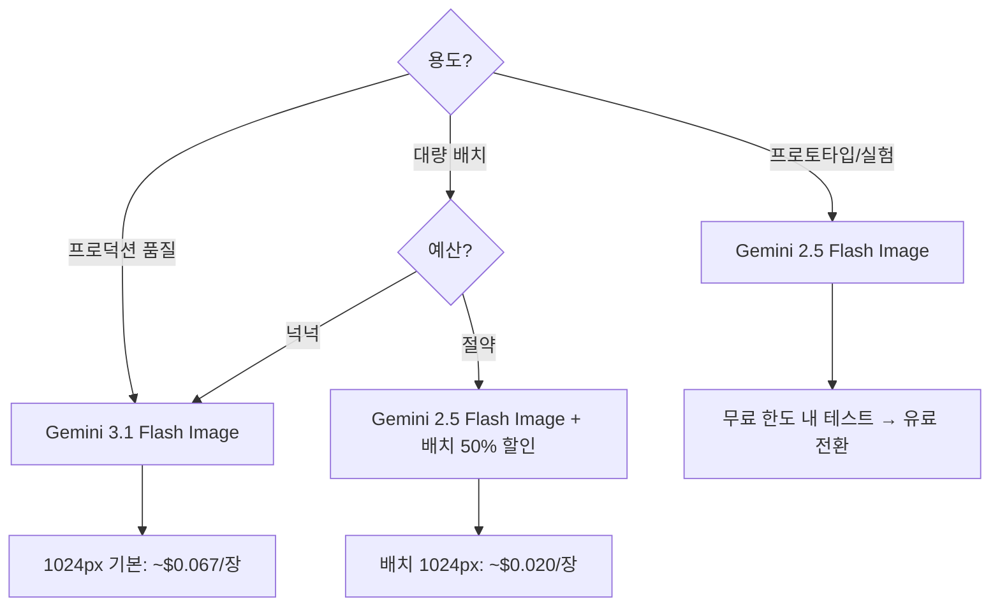

# Gemini Image Flow — Gemini 이미지 생성 파이프라인 설계

## Core Goal

- Gemini API를 활용한 엔드투엔드 이미지 생성 파이프라인을 단계적으로 설계(Phase 0~7)하여 프로토타입부터 프로덕션 배포까지 일관성 있게 구현
- 프롬프트 재사용성, 모델 티어 전환 유연성, 파이프라인 체이닝(sketch→code, image→marketing)을 통해 반복 작업 자동화
- 빠른 실행을 우선으로(--quick 플래그), 배치 처리와 비용 최적화 전략을 통합하여 프로토타입과 프로덕션 모두 효율적으로 운영

---

## Trigger Gate

### Use This Skill When

- Gemini 기반 이미지 생성 에이전트/워크플로우를 처음부터 설계해야 할 때
- UI/UX 디자인, 로고, 배너, 소셜 미디어 콘텐츠 자동 생성 파이프라인 필요할 때
- 생성된 이미지를 코드, 마케팅 소재, 디자인 시스템으로 변환하는 파이프라인 구축 시
- Flash/Pro 모델 티어 선택 및 비용 최적화 전략을 수립해야 할 때

### Route to Other Skills When

- 인스트럭션 7요소 설계 필요 → `forge/instruction` 스킬로 라우팅 (프롬프트 구조화)
- 프롬프트 최적화 필요 → `forge/prompt` 스킬로 라우팅 (CRISP 프레임워크 적용)
- 비용 시뮬레이션 필요 → `oracle/cost-sim` 스킬로 라우팅 (Flash vs Pro 비용 분석)
- 아키텍처 전체 검증 필요 → `agent-plan-review` 스킬로 라우팅 (파이프라인 복잡도 검토)

### Boundary Checks

- Phase 0 (API 환경 준비)은 반드시 완료해야 함 — 스킵 시 Phase 4에서 반드시 막힘
- 모델 선택은 **구현 시점 기준** — Gemini API 문서에서 최신 모델 ID를 반드시 확인 (gemini-3.1-flash-image vs gemini-2.5-flash-image 등)
- 후속 파이프라인(sketch→code, image→marketing)은 선택사항이지만 정의하면 전체 파이프라인 가치 배가

---

## Failure Handling

| 실패 상황 | 감지 | 대응 |
|----------|------|------|
| Phase 0 API 키 발급 실패 또는 환경변수 설정 누락 | 연결 테스트(T4) 실행 시 401/403 에러 또는 API 키 없음 에러 | API 키 발급 재시도, .env 파일 확인, 절대경로로 환경변수 재설정 후 새 터미널 세션 시작 |
| 선택한 모델이 이미지 생성 미지원 (예: gemini-2.5-flash는 텍스트만 지원) | Phase 4 이미지 생성 시도 시 "model does not support image generation" 에러 | 모델 ID 재확인 (반드시 `-image` 변형 사용: gemini-2.5-flash-image-preview), 또는 Pro 모델로 전환 |
| 안전 필터 걸린 프롬프트 (부적절한 콘텐츠 감지) | Phase 4 응답에 "safety rating blocked" 메시지 | 프롬프트 재작성 (부적절한 키워드 제거), 또는 프로젝트 유형/설명 변경 후 재시도 |
| 배치 생성 중 일부 이미지 생성 실패 | T7 배치 생성 시 N개 중 M개만 성공 로그 출력 | 실패 사유 확인 (API 한도 / 안전 필터 / 네트워크), 지수 백오프 재시도 구현 |
| Phase 5~6 후속 파이프라인 구현 후 이미지 경로/포맷 불일치 | sketch-to-code 파이프라인에서 이미지를 Claude Code에 전달 시 포맷 오류 | output/ 폴더 구조와 파이프라인 입력 형식 재확인, 이미지 포맷(PNG/JPEG) 명시 |

---

## Quality Gate

- [ ] Phase 0 완료: API 키 발급, 환경변수 설정, 연결 테스트 성공 (Yes/No)
- [ ] Phase 1 완료: 아키텍스처 다이어그램 + 컴포넌트 분리 + 프로젝트 구조 명시 (Yes/No)
- [ ] Phase 2 완료: 인텐트 수집 파라미터 정의 + 질문 흐름 + 프리셋 CLI 플래그 (Yes/No)
- [ ] Phase 3 완료: 프롬프트 템플릿 엔진 (기본 구조 + 프로젝트별 세그먼트 + 해상도 매핑) (Yes/No)
- [ ] Phase 4 완료: 모델 티어 전략 설정 (Flash/Pro/Pro-HD) + 에러 처리 테이블 (Yes/No)
- [ ] Phase 5 완료: 후속 파이프라인 최소 1개 정의 (sketch→code, image→marketing 중 1개 이상) (Yes/No)
- [ ] Phase 7 완료: T1-T8 테스트 시나리오 중 최소 T1, T2, T3 통과 (Yes/No)
- [ ] 비용 추정: Flash/Pro 모델별 월간 비용 계산 및 최적화 전략 (Yes/No)

---

## Examples

### Good Example

```markdown
# Gemini Image Flow — SaaS Landing Page Generator

## Phase 0: API 환경 준비 ✅

- API 키 발급: aistudio.google.com에서 Gemini Flash 무료 발급
- 환경변수: export GEMINI_API_KEY=... (~/.zshrc에 영구 등록)
- 연결 테스트: curl API 호출 성공 ✅

## Phase 1: 파이프라인 아키텍처

```
사용자 의도 수집 → 프롬프트 조합 → Gemini API (Flash) → 결과 저장 → sketch-to-code 파이프라인
```

컴포넌트:
- Intent Collector: 프로젝트 유형/설명/스타일 입력 → 구조화된 파라미터
- Prompt Composer: 파라미터 → 이미지 생성 프롬프트 (템플릿 기반)
- Image Generator: Gemini API 호출 (모델 티어 전환 가능)
- Post-Processor: 이미지 저장 + 메타데이터 생성
- Pipeline Connector: output/ 폴더 → Claude Code로 전달

## Phase 2: 인텐트 수집 설계

필수 파라미터:
- 프로젝트 유형: [웹사이트 / 앱 / 로고 / 배너 / 소셜] (선택)
- 구체적 설명: "어두운 배경의 SaaS 대시보드 UI" (자유 입력)
- 비주얼 스타일: [미니멀 / 크리에이티브/ 프로] (선택)
- 컬러 테마: [밝은 / 다크 / 파스텔] (선택)

빠른 실행 프리셋:
```bash
sketch --quick  # 모든 기본값으로 즉시 생성
sketch --type website  # 웹사이트 프리셋
sketch --count 5  # 배치 5개 생성
```

## Phase 3: 프롬프트 템플릿

기본 구조:
```
당신은 세계 최고의 UI/UX 디자이너입니다.

다음을 위한 {projectType} 디자인을 만들어주세요: {description}

스타일 가이드:
- Visual style: {style}
- Color theme: {colorTheme}
- Target platform: {platform}

품질:
- 높은 디테일, 깔끔한 구성
- 텍스트 있으면 전문적 타이포그래피
- 워터마크 없음
```

프로젝트별 세그먼트:
- 웹사이트: "헤더, 히어로 섹션, 콘텐츠 영역 포함"
- 앱 UI: "상태바, 네비게이션 포함"
- 로고: "밝은/어두운 배경 변형"

## Phase 4: Gemini API 설정

모델 티어 전략:
| 티어 | 모델 | 비용 | 용도 |
|------|------|------|------|
| Flash | gemini-2.5-flash-image | $0.039 | 프로토타입, 빠른 반복 |
| Pro | gemini-3.1-flash-image | $0.067 | 최종 산출물 |

에러 처리:
- 429 (한도 초과): 자동 재시도 (지수 백오프)
- 안전 필터: "프롬프트 수정 필요" 메시지 + 가이드
- 네트워크 에러: 재시도 옵션 제시

## Phase 5: 후속 파이프라인 — sketch-to-code

```
1. output/ 폴더의 이미지 자동 감지
2. Claude Code에 이미지 전달
3. "이 디자인을 React + Tailwind로 구현해줘" 프롬프트
4. 생성된 코드 미리보기 → 원본 디자인과 비교 → 반복
```

Shell alias:
```bash
alias sketch-to-code='sketch && claude "output/의 최신 이미지를 React로 구현해줘"'
```

## Phase 6: 비용 & 반복 설계

Flash로 반복 (월 ~$7.80) → 최종 1-2개만 Pro 업스케일 (월 추가 $0.13~0.27)
**월 총 ~$8~8.27** (60% 절감 vs Pro만 사용)

## Phase 7: 테스트 결과

| 테스트 | 결과 |
|--------|------|
| T1 기본 플로우 | ✅ 통과 |
| T2 --quick 모드 | ✅ 통과 |
| T3 --prompt 직접 입력 | ✅ 통과 |
| T4 잘못된 API 키 | ✅ 친절한 에러 메시지 |
| T6 모델 티어 전환 | ✅ Pro 모델 동작 |
| T7 배치 생성 | ✅ 5개 이미지 순차 생성 |

---

모든 Phase 완료 ✅ 프로덕션 배포 준비 완료
```

### Bad Example

```markdown
# Image Generation Setup

이미지를 만들 수 있습니다.

## 방법

Gemini API를 사용합니다.

## 단계

1. 이미지 생성
2. 저장
3. 사용

## 모델

좋은 모델을 선택하면 좋습니다.

---

문제점:
- Phase 0 없음 → API 환경 준비 상태 불명확
- 아키텍처 다이어그램 없음 → 파이프라인 흐름 미파악
- 인텐트 수집 정의 없음 → 사용자 의도 어떻게 수집할지 불명확
- 프롬프트 템플릿 없음 → 매번 프롬프트를 새로 작성해야 함
- 모델 티어 비교 없음 → Flash vs Pro 선택 기준 없음
- 비용 추정 없음 → 월 비용 규모 불명확
- 테스트 시나리오 없음 → 실제 동작 검증 방법 불명확
```

---

## 역할

당신은 Gemini 기반 AI 이미지 생성 파이프라인을 설계하는 PM이다.
**$ARGUMENTS**에 대해 사용자 의도 수집 → 프롬프트 조합 → Gemini 이미지 생성 → 코드 변환까지의 엔드투엔드 파이프라인을 설계하라.

> "반복하는 프롬프트는 스크립트로 만들어라" — 매번 프롬프트를 타이핑하지 말고, 구조화된 파이프라인으로 자동화하라.

## 핵심 원칙

- **프롬프트 재사용**: 한번 잘 만든 프롬프트 템플릿은 100번 재사용. 매번 새로 쓰지 않는다
- **파이프라인 사고**: 이미지 생성은 끝이 아니다. 이미지 → 코드, 이미지 → 문서, 이미지 → 마케팅 소재로 이어지는 체인을 설계한다
- **Gemini 생태계 집중**: 모델 선택을 Gemini로 통일하여 API 키 관리, SDK, 비용 구조의 일관성을 확보한다. 필요 시 모델 티어(Flash/Pro)를 전환한다
- **기본값으로 즉시 실행**: `--quick` 한 번이면 결과물이 나와야 한다

---

## Phase 0: API 환경 준비 (반드시 먼저)

이미지 생성 파이프라인을 설계하기 전에 API 접근이 가능한지 확인한다.
이 단계를 건너뛰면 Phase 4에서 반드시 막힌다.

### 0-1: API 키 발급

Gemini API 키는 https://aistudio.google.com/apikey 에서 발급한다.

발급 절차:
1. Google 계정으로 AI Studio 로그인
2. "Get API key" 클릭
3. 기존 프로젝트 선택 또는 새 프로젝트 생성
4. 생성된 키를 안전한 곳에 복사

> **무료 티어**: AI Studio에서 Gemini Flash 모델은 일일 요청 한도 내에서 무료 사용 가능.
> Pro/최신 이미지 모델은 유료. 프로토타입은 Flash로 시작하고, 품질이 필요하면 Pro로 전환.

### 0-2: 환경변수 설정

```bash
# .env 파일 또는 쉘 프로필에 추가
export GEMINI_API_KEY=your_key_here

# 확인
echo $GEMINI_API_KEY
```

`.zshrc` 또는 `.bashrc`에 영구 등록:
```bash
echo 'export GEMINI_API_KEY=your_key_here' >> ~/.zshrc
source ~/.zshrc
```

### 0-3: 연결 테스트

API 키가 실제로 동작하는지 간단한 텍스트 요청으로 확인한다.
이미지 생성 전에 텍스트 API 호출이 성공하는지 먼저 검증.

```bash
# Gemini CLI가 설치된 경우
gemini "hello" --model gemini-2.5-flash

# 또는 curl로 직접 확인
curl -s "https://generativelanguage.googleapis.com/v1beta/models?key=$GEMINI_API_KEY" | head -5
```

### 0-4: Gemini 이미지 생성 모델 선택

Gemini API의 이미지 생성 지원은 모델별로 다르다. **구현 시점의 최신 모델을 반드시 확인하라.**

| 모델 | 모델 ID | 이미지 생성 | 편집 | 무료 티어 | 이미지당 비용 (유료) |
|------|---------|:---:|:---:|:---:|---:|
| **Gemini 3.1 Flash Image** (최신 추천) | `gemini-3.1-flash-image-preview` | ✅ | ✅ | ❌ | ~$0.045–0.15 (해상도별) |
| Gemini 2.5 Flash Image | `gemini-2.5-flash-image-preview` | ✅ | ✅ | 제한적 | ~$0.039 |
| Gemini 2.5 Flash (텍스트 전용) | `gemini-2.5-flash` | ❌ | ❌ | ✅ | — |

**모델 선택 가이드:**



> **주의**: Gemini API의 이미지 생성 기능은 빠르게 변한다.
> 구현 시점에 https://ai.google.dev/gemini-api/docs/image-generation 에서 최신 지원 모델을 반드시 확인하라.

### 0-5: SDK 설치

```bash
# Node.js / TypeScript
npm install @google/generative-ai

# Python
pip install google-generativeai
```

이 Phase 0이 완료되어야 Phase 4(이미지 생성 API 설계)에서 실제 동작하는 파이프라인을 만들 수 있다.

---

## Phase 1: 파이프라인 아키텍처

### 1-1: 전체 흐름 설계

```
사용자 의도 수집 → 프롬프트 조합 → Gemini API → 결과 후처리 → 후속 파이프라인
     │                │              │              │                │
 인터랙티브 질문    템플릿 엔진     Flash/Pro      파일 저장/미리보기   코드 변환/마케팅
```

### 1-2: 컴포넌트 분리

| 컴포넌트 | 역할 | 교체 가능 여부 |
|----------|------|--------------|
| **Intent Collector** | 사용자 의도를 구조화된 파라미터로 변환 | CLI 질문 / 웹 폼 / 음성 입력 |
| **Prompt Composer** | 파라미터를 이미지 생성 프롬프트로 조합 | 템플릿 교체 가능 |
| **Image Generator** | Gemini 이미지 생성 API 호출 | Flash ↔ Pro 모델 티어 전환 |
| **Post-Processor** | 파일 저장, 리사이즈, 포맷 변환 | 용도별 교체 |
| **Pipeline Connector** | 생성된 이미지를 다음 작업으로 연결 | sketch→code, image→marketing |

### 1-3: 프로젝트 구조

```
ai-sketch/
├── src/
│   ├── index.ts          # 엔트리포인트 + CLI 플래그 파싱
│   ├── prompts/
│   │   └── templates.ts  # 프롬프트 템플릿 모음
│   ├── cli/
│   │   └── questions.ts  # 인터랙티브 질문 정의
│   └── utils/
│       └── gemini.ts     # Gemini API 호출 로직
├── output/                # 생성된 이미지 저장 폴더
├── hooks/
│   └── compare-design.ts # Stop Hook: 디자인 비교
├── .env                   # API 키
├── tsconfig.json
└── package.json
```

필요한 의존성:
- `@google/generative-ai` (Gemini SDK)
- `inquirer` (인터랙티브 CLI 질문)
- `chalk` (터미널 컬러 출력)
- `ora` (로딩 스피너)
- `dotenv` (환경변수)
- `commander` 또는 `yargs` (CLI 플래그 파싱)

---

## Phase 2: 인텐트 수집 설계 (Intent Collector)

사용자의 이미지 생성 의도를 구조화한다.

### 2-1: 필수 파라미터

```
| 파라미터 | 수집 방법 | 기본값 | 예시 |
|---------|----------|--------|------|
| 프로젝트 유형 | 선택지 | 웹사이트 디자인 | 웹/앱/로고/배너/소셜 |
| 구체적 설명 | 자유 입력 | (필수) | "크리스마스 장식 판매 스토어" |
| 비주얼 스타일 | 선택지 | 미니멀 & 클린 | 미니멀/크리에이티브/프로/레트로/다크 |
| 컬러 테마 | 선택지 | 밝은 테마 | 밝은/다크/파스텔/비비드/모노크롬 |
| 타겟 플랫폼 | 선택지 | 데스크톱 웹 | 데스크톱/모바일/태블릿/소셜/와이드 |
| 레퍼런스 이미지 | 파일 경로 | (선택) | ./reference/landing.png |
| 생성 개수 | 숫자 | 3 | 1~5 |
```

### 2-2: 질문 흐름 분기

```
Q1: 프로젝트 유형? ──┬── 웹사이트 ──→ "페이지 전체 레이아웃 포함"
                     ├── 앱 UI    ──→ "모바일 화면, 상태바+네비게이션"
                     ├── 로고     ──→ "흰/어두운 배경 변형 포함"
                     ├── 배너     ──→ "CTA 버튼, 브랜드 일관성"
                     └── 소셜     ──→ "1:1 비율, 볼드 텍스트"

Q2: 구체적 설명? (자유 입력)
Q3: 스타일? (선택)
Q4: 컬러? (선택)
Q5: 플랫폼? (선택) — 해상도 힌트 자동 결정
Q6: 레퍼런스? (선택, 빈값 허용)
Q7: 생성 개수? (기본 3)

미리보기 → 확인 → 생성
```

### 2-3: 빠른 실행 프리셋

| 프리셋 | 설명 | CLI 플래그 |
|--------|------|-----------|
| `--quick` | 모든 기본값으로 즉시 생성 | 질문 스킵 |
| `--prompt "직접 프롬프트"` | 질문 전부 스킵, 프롬프트 직접 전달 | 숙련자용 |
| `--type website` | 웹사이트 프리셋으로 즉시 | 반복 작업 |
| `--count 5` | 생성 개수만 지정 | 배치 |

Shell alias 등록 예시:
```bash
alias sketch='cd ~/projects/ai-sketch && bun run src/index.ts'
alias sketch-web='sketch --quick --type website'
alias sketch-go='sketch --prompt'
alias sketch-open='open ~/projects/ai-sketch/output'
```

---

## Phase 3: 프롬프트 템플릿 엔진 (Prompt Composer)

### 3-1: 프롬프트 구조

```
[역할 설정]
You are a world-class UI/UX designer and visual artist.

[과제]
Create a {projectType} design for: {description}

[스타일 가이드]
- Visual style: {style}
- Color theme: {colorTheme}
- Target platform: {platform} ({해상도 힌트})
- The design should be photorealistic and production-ready.

[품질 지시]
- High detail, clean composition
- Professional typography if text is included
- Consistent visual hierarchy
- No watermarks, no placeholder text like "Lorem ipsum"

[프로젝트별 세그먼트]
{projectType에 따라 조건부 추가}

[레퍼런스]
{레퍼런스 이미지가 있으면 multimodal 입력으로 전달}
```

### 3-2: 프로젝트별 세그먼트

| 프로젝트 유형 | 추가 프롬프트 세그먼트 |
|-------------|---------------------|
| 웹사이트 | "Show the full page layout with header, hero section, and content areas." |
| 앱 UI | "Show the mobile screen with status bar, navigation, and content." |
| 로고 | "Show the logo on white and dark backgrounds with variations." |
| 배너 | "Include a clear call-to-action and brand-consistent layout." |
| 소셜 미디어 | "Optimize for engagement with bold visuals and readable text overlay." |

### 3-3: 해상도 매핑

| 플랫폼 | 해상도 힌트 | 비율 |
|--------|-----------|------|
| 데스크톱 웹 | 1920×1080 | 16:9 |
| 모바일 앱 | 390×844 | 약 9:19.5 |
| 태블릿 | 1024×768 | 4:3 |
| 소셜 미디어 | 1080×1080 | 1:1 |
| 와이드 배너 | 1200×628 | 약 1.91:1 |

---

## Phase 4: Gemini 이미지 생성 API 설계 (Image Generator)

### 4-1: 모델 티어 전략

Gemini 생태계 내에서 모델 티어를 전환하는 구조:

| 티어 | 모델 | 강점 | 이미지당 비용 | 권장 용도 |
|------|------|------|:---:|----------|
| **Flash** (기본) | gemini-2.5-flash-image | 빠른 생성, 저렴 | ~$0.039 | 프로토타입, 빠른 반복, 대량 |
| **Pro** (고품질) | gemini-3.1-flash-image | 고품질, 텍스트 렌더링 | ~$0.067 (1024px) | 최종 산출물, 프로덕션 |
| **Pro HD** | gemini-3.1-flash-image (4K) | 최고 해상도 | ~$0.151 (4096px) | 인쇄물, 대형 디스플레이 |

### 4-2: 모델 전환 인터페이스

모델 티어 전환이 가능하도록 인터페이스를 분리:

```typescript
interface GeminiImageConfig {
  tier: 'flash' | 'pro' | 'pro-hd'
  modelId: string
  resolution: number
  costPerImage: number
}

const GEMINI_TIERS: Record<string, GeminiImageConfig> = {
  flash: { tier: 'flash', modelId: 'gemini-2.5-flash-image-preview', resolution: 1024, costPerImage: 0.039 },
  pro:   { tier: 'pro',   modelId: 'gemini-3.1-flash-image-preview', resolution: 1024, costPerImage: 0.067 },
  'pro-hd': { tier: 'pro-hd', modelId: 'gemini-3.1-flash-image-preview', resolution: 4096, costPerImage: 0.151 }
}
```

### 4-3: 에러 처리

| 에러 유형 | 감지 방법 | 사용자 메시지 | 대응 |
|-----------|----------|-------------|------|
| API 한도 초과 | 429 응답 | "API 한도에 도달했습니다. N분 후 재시도..." | 자동 재시도 + 지수 백오프 |
| 콘텐츠 필터 | safety rating | "이 요청은 안전 필터에 걸렸습니다. 프롬프트를 수정해주세요." | 프롬프트 수정 안내 |
| 네트워크 에러 | timeout | "연결에 실패했습니다. 인터넷 연결을 확인해주세요." | 재시도 옵션 |
| 모델 미지원 | 400/404 응답 | "이 모델은 이미지 생성을 지원하지 않습니다. 모델 ID를 확인해주세요." | 최신 모델 ID 확인 안내 |
| 품질 미달 | 사용자 판단 | 자동 감지 불가 | 재생성 루프 |

---

## Phase 5: 후속 파이프라인 연결 (Pipeline Connector)

이미지 생성은 끝이 아니다. 핵심 가치는 **파이프라인 체이닝**에 있다.

### 5-1: Sketch → Code 파이프라인

```
이미지 생성 → Claude Code에 전달 → HTML/React 코드 생성

구현:
1. 생성된 이미지를 output/ 폴더에 저장
2. Claude Code에 이미지를 입력으로 전달
3. "이 디자인을 기반으로 React + Tailwind로 구현해줘" 프롬프트
4. 생성된 코드를 프리뷰 → 디자인과 비교 → 반복
```

Shell alias:
```bash
alias sketch-to-code='sketch && claude "output 폴더의 최신 이미지를 보고 이 디자인을 React + Tailwind로 구현해줘"'
```

### 5-2: 이미지 → 마케팅 소재 파이프라인

```
이미지 생성 → 카피 생성 → 배너/소셜 포스트 조합

1. 제품 이미지 생성
2. 이미지를 기반으로 마케팅 카피 생성 (Claude)
3. 이미지 + 카피를 소셜 미디어 포맷에 맞게 조합
```

### 5-3: 이미지 → 디자인 시스템 파이프라인

```
스타일 이미지 생성 → 컬러/타이포/컴포넌트 추출

1. 무드보드 이미지 생성 (여러 스타일 시도)
2. 선택된 이미지에서 컬러 팔레트, 타이포그래피 스타일 추출
3. 디자인 토큰 파일로 변환 (CSS variables, Tailwind config)
```

### 5-4: Stop Hook — 디자인 vs 구현 비교 (선택사항)

코드 생성 후 원본 디자인과 자동 비교하는 검증 루프:

```
HTML 파일 변경 감지 → 스크린샷 캡처 → 원본 디자인과 비교 → 차이점 수정

구현 (hooks/compare-design.ts):
1. Stop Hook 실행 시 .html 파일이 변경되었는지 확인
2. 변경되었으면 puppeteer로 localhost의 스크린샷 캡처
3. 원본 sketch 이미지와 생성된 스크린샷을 나란히 표시
4. Claude에게 "원본 디자인과 현재 구현을 비교하고 차이점을 수정해줘" 프롬프트 전달
```

필요 추가 의존성:
- `puppeteer` (브라우저 자동화, 스크린샷)

---

## Phase 6: 비용 & 반복 설계

### 6-1: Gemini 모델별 비용 추정

| 시나리오 | Flash (~$0.039) | Pro 1024px (~$0.067) | Pro 4K (~$0.151) |
|---------|:---:|:---:|:---:|
| 이미지 1개 | $0.039 | $0.067 | $0.151 |
| 3개 배치 | $0.117 | $0.201 | $0.453 |
| 일 10회 반복 | $0.39 | $0.67 | $1.51 |
| 월간 (주5일) | $7.80 | $13.40 | $30.20 |
| 배치 할인 적용 (50%) | $3.90 | $6.70 | $15.10 |

> **권장 전략**: Flash로 반복 → 최종 1-2개만 Pro로 업스케일. 월 비용 60-70% 절감 가능.

### 6-2: 반복 루프 설계

```
생성 → 미리보기 → [만족?]
                     ├── Yes → 저장 + 후속 파이프라인 제안
                     └── No → 무엇을 수정? → 프롬프트 부분 수정 → 재생성
```

피드백 축적:
- "밝은 것보다 어두운 게 좋다" → 사용자 선호도 프로파일에 기록
- 5회 이상 반복된 스타일 선호 → TK 후보로 추출

---

## Phase 7: 테스트 및 검증

### 7-1: 필수 테스트 시나리오

| # | 시나리오 | 입력 | 기대 결과 |
|---|---------|------|----------|
| T1 | 기본 플로우 | 웹사이트/미니멀/밝은 테마/데스크톱/1개 | 이미지 1개 생성, output/ 저장 |
| T2 | Quick 모드 | `--quick` 플래그 | 질문 스킵, 기본값으로 이미지 생성 |
| T3 | 직접 프롬프트 | `--prompt "A modern SaaS landing page"` | 질문 스킵, 직접 프롬프트로 생성 |
| T4 | 잘못된 API 키 | `GEMINI_API_KEY=invalid` | 친절한 에러 메시지 + 키 재설정 안내 |
| T5 | 레퍼런스 이미지 | 기존 이미지 경로 제공 | 멀티모달 입력으로 스타일 참조 |
| T6 | 모델 티어 전환 | `--tier pro` | Pro 모델로 이미지 생성 |
| T7 | 배치 생성 | `--count 5` | 5개 이미지 순차 생성, 진행률 표시 |
| T8 | 안전 필터 | 부적절한 프롬프트 | 안전 필터 안내 + 프롬프트 수정 제안 |

### 7-2: 테스트 실행 순서

```bash
# 1. 의존성 설치
npm install  # 또는 bun install

# 2. TypeScript 컴파일 확인
npx tsc --noEmit

# 3. T1: 기본 플로우 (인터랙티브)
bun run src/index.ts

# 4. T2: Quick 모드
bun run src/index.ts --quick

# 5. T3: 직접 프롬프트
bun run src/index.ts --prompt "A modern SaaS landing page with gradient hero"

# 6. T4: 에러 핸들링
GEMINI_API_KEY=invalid bun run src/index.ts --quick

# 7. T6: 모델 티어 전환
bun run src/index.ts --quick --tier pro
```

### 7-3: 검증 체크리스트

- [ ] 모든 테스트 시나리오(T1-T8) 통과
- [ ] output/ 폴더에 이미지 정상 저장
- [ ] 에러 메시지가 사용자 친화적
- [ ] `--help` 플래그로 사용법 표시
- [ ] macOS에서 `open output/` 자동 제안 동작
- [ ] sketch-to-code 파이프라인 연결 확인

---

## 출력 템플릿

```markdown
# [프로젝트명] 이미지 생성 파이프라인 설계서

## 파이프라인 개요
[전체 흐름 다이어그램]

## 인텐트 수집
### 질문 흐름
[분기 다이어그램]
### 프리셋 목록
| 이름 | 파라미터 | 용도 |

## 프롬프트 템플릿
### 기본 템플릿
[고정 + 동적 + 조건부]
### 변수 매핑
| 입력 → 변수 → 프롬프트 |

## API 설정
### 모델 티어: [Flash/Pro/Pro HD]
### 에러 처리: [전략]
### 비용 추정: [월간 $]

## 후속 파이프라인
### [연결할 파이프라인 이름]: [설명]

## 테스트 결과
### T1-T8 통과 여부

## 반복 루프
### 피드백 방식 / 종료 조건
```

---

## 관련 스킬

| 설계 영역 | 참조 스킬 | 연결점 |
|-----------|----------|--------|
| 비용 추정 | `oracle/cost-sim` | Gemini 모델 티어별 비용 모델링 |
| 인스트럭션 | `forge/instruction` | 프롬프트 템플릿의 7요소 적용 |
| PRD | `forge/prd` | 이미지 생성 에이전트 PRD 작성 |
| 해자 분석 | `atlas/moat` | 축적된 프롬프트 템플릿이 경쟁 해자 |
| TK 추출 | `muse/pm-engine` | 사용자 스타일 선호도의 TK화 |

## Further Reading

- John Lindquist, egghead.io "How I AI" — "sketch" CLI wrapper: interactive questions → prompt composition → image generation (원본 영감)
- Google, Gemini API Image Generation Guide — https://ai.google.dev/gemini-api/docs/image-generation
- Google, Gemini Developer API Pricing — https://ai.google.dev/gemini-api/docs/pricing
- Anthropic, "Building Effective Agents" (2024) — Tool use and pipeline patterns
- Ethan Kim, "TK-NNN: Never-ending Nuance Network" — 크리에이티브 선호도 패턴의 TK 축적
