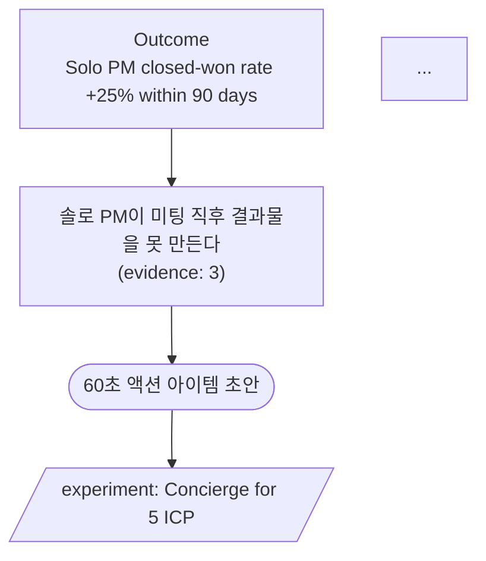

# Good Example — MeetFlow OST

## Input (ost.json)

```json
{
  "outcome": "Solo PM closed-won rate +25% within 90 days",
  "opportunities": [
    {
      "name": "솔로 PM이 미팅 직후 결과물을 못 만든다",
      "evidence_count": 3,
      "solutions": [
        {"name": "60초 액션 아이템 초안", "experiment": "Concierge for 5 ICP", "decision_rule": "5/5가 그대로 사용"},
        {"name": "후속 메일 1-click", "experiment": "Manual draft compare", "decision_rule": "override <20%"}
      ]
    },
    {
      "name": "다음 미팅 준비가 늦어 같은 안건 반복",
      "evidence_count": 2,
      "solutions": [
        {"name": "이전 미팅 자동 브리프", "experiment": "Email 3 trials", "decision_rule": "3/3 만족"}
      ]
    }
  ]
}
```

## Generate

```bash
python3 hplan/scripts/ost_generator.py ost.json --out docs/OPPORTUNITY_TREE.md
```

## Output (excerpt)



## Why this is *good*

- Outcome은 measurable + 90일 시한
- Opportunity #1은 evidence 3 → 정식 진행. #2는 evidence 2 → "parking lot" 후보 (flag).
- 각 solution은 experiment + decision_rule 있음 → 어디서 멈출지 명확
- Solution은 "기능"이 아니라 "사용자 결과" — "후속 메일 1-click"은 결과(메일 발송) 중심
