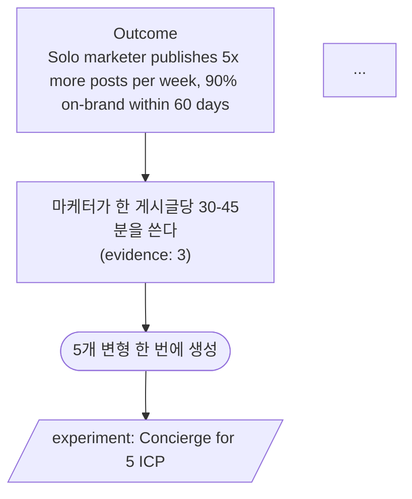

# Good Example — SocialDraft OST

## Input (ost.json)

```json
{
  "outcome": "Solo marketer publishes 5x more posts per week, 90% on-brand within 60 days",
  "opportunities": [
    {
      "name": "마케터가 한 게시글당 30-45분을 쓴다",
      "evidence_count": 3,
      "solutions": [
        {"name": "5개 변형 한 번에 생성", "experiment": "Concierge for 5 ICP", "decision_rule": "5/5가 그대로 사용"},
        {"name": "브랜드 가이드 자동 적용", "experiment": "Manual draft compare", "decision_rule": "override <20%"}
      ]
    },
    {
      "name": "캠페인 데드라인을 자주 놓친다",
      "evidence_count": 2,
      "solutions": [
        {"name": "주간 콘텐츠 캘린더 자동 생성", "experiment": "Email 3 trials", "decision_rule": "3/3 만족"}
      ]
    }
  ]
}
```

## Generate

```bash
python3 hplan/scripts/ost_generator.py ost.json --out docs/OPPORTUNITY_TREE.md
```

## Output (excerpt)



## Why this is *good*

- Outcome은 measurable + 90일 시한
- Opportunity #1은 evidence 3 → 정식 진행. #2는 evidence 2 → "parking lot" 후보 (flag).
- 각 solution은 experiment + decision_rule 있음 → 어디서 멈출지 명확
- Solution은 "기능"이 아니라 "사용자 결과" — "브랜드 가이드 자동 적용"은 결과(메일 발송) 중심
